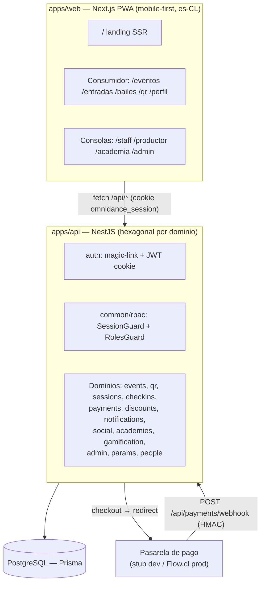
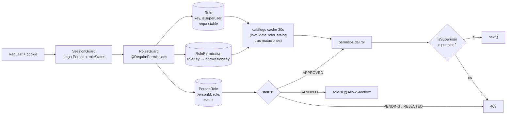
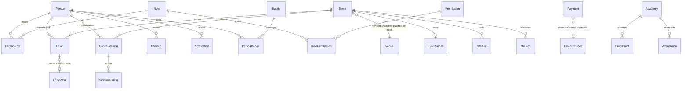

# Arquitectura — omni-dance

Plataforma unificada para la escena SBK de Santiago: bailarines, eventos sociales, productores, DJs, venues, academias, staff y administración.

> Última actualización: 2026-09-17 (post-ola wiring + endpoints). Mantener sincronizado con `apps/api/src/app.module.ts` y `apps/api/prisma/schema.prisma`.

## Vista general



**Un solo backend, una sola PWA.** Las consolas de gestión son rutas de la misma app, gateadas por rol — no son apps separadas.

## Patrón por módulo

Cada dominio sigue arquitectura hexagonal:

```
src/<dominio>/
  domain/           # lógica pura, sin Nest ni Prisma — testeable aislado
    *.service.ts    # reglas de dominio
    ports.ts        # interfaces del repo
    *.spec.ts       # tests unitarios puros
  infrastructure/   # adaptadores Nest
    *.controller.ts # HTTP: guards, DTOs, orquestación
    prisma-*.ts     # implementación Prisma de los ports
<dominio>.module.ts # wiring: imports, controllers, providers
```

- El dominio **no importa Nest** — los servicios se construyen con `useFactory` en el módulo.
- Los controllers hacen orquestación (Prisma directo para lecturas) y delegan reglas al dominio.
- Tests: `src/**/*.spec.ts` unitarios puros; `test/*.e2e.spec.ts` contra Postgres real (`localhost:5433`).

## Módulos activos (app.module.ts)

| Módulo | Rutas | Guard |
|---|---|---|
| auth | `/api/auth/*` magic-link, session, logout | — |
| people | `/api/me` perfil + roleStates | SessionGuard |
| events | `/api/events*` catálogo público | público / SessionGuard |
| qr | `/api/qr/mine` QR rotativo | SessionGuard |
| sessions | `/api/sessions/*` invitar/confirmar/puntuar | SessionGuard + wiring notify+badges |
| checkins | `/api/checkins*` staff door scan/manual | `checkins.write` |
| payments | `/api/checkout`, `/api/tickets`, `/api/payments/webhook` | mixto |
| discounts | `/api/discount-codes*` CRUD | `discounts.manage` |
| notifications | `/api/notifications`, `/api/push-tokens` | SessionGuard |
| social | `/api/events/:id/rsvp|waitlist`, `/practices`, `/trips`, `/venues`, `/styles`, `/partner-requests`, `/availability`, `/guest-lists` | mixto `social.manage` |
| academies | `/api/academies/*` planes, enrollments, asistencia | `academies.create` / owner |
| gamification | `/api/gamification/*` streaks, badges, leaderboard, misiones | SessionGuard |
| params | `/api/params/public`, `/api/admin/params` | público / `admin.access` |
| leads | `POST /api/leads` — formulario de contacto/demo de la landing `/pro`, notifica a ADMIN | público |
| admin | `/api/admin/*` usuarios (búsqueda, ficha 360°, asignación de roles), analítica por usuario, explorador `/admin/browse/:entity`, roles, permisos, audit | `admin.access` |

## RBAC — todo DB-driven



- **Nada hardcodeado en runtime**: roles, permisos, grants y estados viven en `Role`, `Permission`, `RolePermission`, `PersonRole`.
- `PersonRole.status`: `PENDING` (sin acceso) → `APPROVED` (acceso) | `REJECTED` (fila preservada) | `SANDBOX` (acceso limitado donde `@AllowSandbox`). El admin fija el status directo con `POST /admin/users/:personId/roles`.
- `ADMIN` es `isSuperuser` — bypass total, solo seteable por seed (no vía API admin).
- Los roles **no son auto-solicitables**: la única vía es la asignación admin desde `/admin/usuarios` (`Role.requestable` quedó inerte en el schema).
- `@RequireRoles` existe como escape hatch pero ningún controller lo usa — todo es `@RequirePermissions`.

## Parámetros de plataforma

`PlatformParam` (JSON por key, cache 30s, `getNumber(key, fallback→env→default)`):

| Key | Consumidor | Default |
|---|---|---|
| `service_fee.presale_clp` | checkout + webhook | 500 |
| `service_fee.door_app_clp` | checkin app | 700 |
| `service_fee.door_cash_clp` | checkin efectivo | 0 |
| `session.cooldown_minutes` | sessions invite | 4 |
| `qr.rotation_seconds` | QR mint | 60 |
| `prime_time.window_minutes` | gamificación (default de creación de eventos) | 30 |
| `prime_time.threshold_pct` | gamificación fallback aforo | 0.2 |

Edición en vivo vía `PUT /api/admin/params/:key` (audita `PARAM_UPDATE`). El seed hace `upsert` con `update:{}` — **no pisa valores editados**.

## Modelo de datos (núcleo)



## Wiring de notificaciones y gamificación

`NotificationsService` y `GamificationService.evaluateBadgesFor` se inyectan **opcionales** en los controllers que los disparan (fail-safe: su ausencia es no-op, nunca rompe el flujo):

| Trigger | Módulo | Efecto |
|---|---|---|
| `sessions.invite` | sessions | notify SOCIAL `session.invite` al invitee |
| `sessions.act(confirm)` | sessions | notify `session.confirmed` al inviter + evalúa badges de ambos |
| `sessions.act(decline)` | sessions | notify `session.declined` al inviter |
| `sessions.rate` | sessions | `status → RATED` + evalúa badges de rater y rated |
| `webhook PAID` | payments | notify TRANSACTIONAL `payment.paid` (solo si esta llamada marcó PAID — flag `paidNow` en la tx) |
| `webhook FAILED` | payments | notify `payment.failed` |
| `waitlist.promote` | social | notify SOCIAL `waitlist.promoted` |

`RATED` cuenta como actividad confirmada en streaks/badges/misiones/leaderboard (`confirmedSessions*` incluye `["CONFIRMED","RATED"]`).

## Persistencia y seeds

- **Prisma + Postgres** (`localhost:5433` en docker-compose dev).
- Seeds idempotentes (`SEED_ENV=dev|prod`): `seed-common` (catálogos RBAC, permisos, estilos, badges, params por upsert) + `seed-dev` (demo Santiago, `*@omnidance.dev` logueables) / `seed-prod` (baseline + admin desde `SEED_ADMIN_EMAIL`).
- `prisma db push` en dev; el watch del API debe detenerse antes (lock del query engine).

## Docs operativas

- **Swagger UI**: `http://localhost:4000/api/docs` — OpenAPI JSON en `/api/docs-json`.
- **Export**: `node apps/api/scripts/export-api-docs.cjs` → `docs/openapi.json` + `docs/postman/omni-dance.postman_collection.json` (regenerar tras cambios de endpoints).
- **Flujos**: `docs/flows.md` (secuencias y estados en mermaid).
