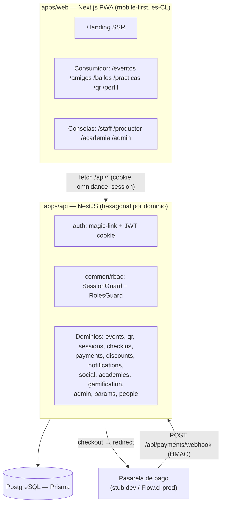
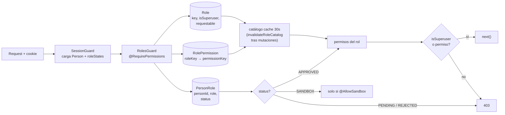
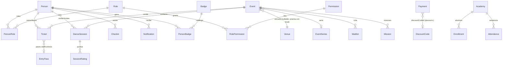

# Arquitectura — omni-dance

Plataforma unificada para la escena SBK de Santiago: bailarines, eventos sociales, productores, DJs, venues, academias, staff y administración.

> Última actualización: 2026-10-04 (suscripciones de plataforma — SaaS academia + Producer Pro). Mantener sincronizado con `apps/api/src/app.module.ts` y `apps/api/prisma/schema.prisma`.

## Vista general


```mermaid
graph TB
    subgraph Client["apps/web — Next.js PWA (mobile-first, es-CL)"]
        Landing["/ landing SSR"]
        Consumer["Consumidor: /eventos /amigos /bailes /practicas /qr /perfil"]
        Ops["Consolas: /staff /productor /academia /admin"]
    end

    subgraph API["apps/api — NestJS (hexagonal por dominio)"]
        Auth["auth: magic-link + JWT cookie"]
        RBAC["common/rbac: SessionGuard + RolesGuard"]
        Domains["Dominios: events, qr, sessions, checkins,<br/>payments, discounts, notifications,<br/>social, academies, gamification,<br/>admin, params, people"]
    end

    DB[(PostgreSQL — Prisma)]
    Ext["Pasarela de pago<br/>(stub dev / Flow.cl prod)"]

    Client -->|"fetch /api/* (cookie omnidance_session)"| API
    API --> DB
    API -->|"checkout → redirect"| Ext
    Ext -->|"POST /api/payments/webhook (HMAC)"| API
```

**Un solo backend, una sola PWA.** Las consolas de gestión son rutas de la misma app, gateadas por rol — no son apps separadas.

## Patrón por módulo

Cada dominio sigue arquitectura hexagonal:

```
src/<dominio>/
  domain/           # lógica pura, sin Nest ni Prisma — testeable aislado
    *.service.ts    # reglas de dominio
    ports.ts        # interfaces del repo
    *.spec.ts       # tests unitarios puros
  infrastructure/   # adaptadores Nest
    *.controller.ts # HTTP: guards, DTOs, orquestación
    prisma-*.ts     # implementación Prisma de los ports
<dominio>.module.ts # wiring: imports, controllers, providers
```

- El dominio **no importa Nest** — los servicios se construyen con `useFactory` en el módulo.
- Los controllers hacen orquestación (Prisma directo para lecturas) y delegan reglas al dominio.
- Tests: `src/**/*.spec.ts` unitarios puros; `test/*.e2e.spec.ts` contra Postgres real (`localhost:5433`).

## Módulos activos (app.module.ts)

| Módulo | Rutas | Guard |
|---|---|---|
| auth | `/api/auth/*` magic-link, session, logout | — |
| people | `/api/me` perfil + roleStates + gender; `GET /me/pending-surveys` (eventos evaluables en ventana 24h; el primer request reclama `surveyNotifiedAt` y hace fan-out `event.survey` a todos los asistentes con check-in válido) | SessionGuard |
| events | `/api/events*` catálogo público con `?genre=&venue=&week=this`; `genres` resueltos (evento o heredados de serie); consola productor: `/events/mine` (+stats vendidas/bruto/check-ins), `/events/:id/live` (ventas por canal, check-ins, ocupación — owner/admin), `/events/:id/export.csv|export.pdf?dataset=sales|checkins|guestlist` (CSV operativo / PDF imprimible con resumen — owner/admin; BOM UTF-8, sin claimToken) y `/events/series/:seriesId/export.csv|export.pdf` (mismos datasets agregados por serie con columna `evento`), `/events/:id/ratings/summary` (agregado k≥3), `/events/:id/analytics` (attendees + genderSplit/roleSplit + ratings por dim — null bajo k≥3, owner/admin), `/dj/gigs*` (gigs + sugerencias + rating de música del DJ asignado) | público / SessionGuard / `events.manage` |
| qr | `/api/qr/mine` QR rotativo | SessionGuard |
| sessions | `/api/sessions/*` invitar/confirmar/puntuar | SessionGuard + wiring notify+badges |
| checkins | `/api/checkins*` staff door scan/manual | `checkins.write` |
| payments | `/api/checkout` (ticket / series-pass / membership — plan de academia / **membership-subscription** — suscripción recurrente Flow / `GET membership-quote` / **class** — clase suelta/taller con `GET class-quote` / **private-class** — clase particular comprable con `GET private-class-quote` → orden PRIVATE, settle crea `PrivateLesson` REQUESTED sin instructor/fecha y `PATCH /private-lessons/:id {action:"assign"}` del owner la agenda), `/api/tickets`, `/api/payments/webhook` (Flow notifica `{token}` → se confirma vía `payment/getStatus` firmado), `GET /api/payments/:id` (polling del checkout; si la orden sigue PENDING y el gateway es Flow, consulta `payment/getStatusByCommerceId` y liquida con la misma lógica del webhook — cubre sandbox/dev donde el webhook no alcanza localhost), `/api/subscriptions/mine|/:id|/:id/cancel` (owner), `/api/payments/flow/customer-return` + `/api/payments/subscription-webhook` (públicos, callbacks Flow), `/api/payments/mine|by-event|by-academy|/:id/events` (auditoría por actor — detalle en "Pasarela de pago") | mixto (checkout = preventa o puerta-app según estado/corte del evento) |
| discounts | `/api/discount-codes*` CRUD | `discounts.manage` |
| notifications | `/api/notifications` (`?unread=&limit=&lens=` — lens acota lista y unreadCount al dominio social/academy), `/api/push-tokens` | SessionGuard |
| social | `/api/events/:id/waitlist`, `/practices`, `/venues`, `/styles`, `/partner-requests`, `/availability`, `/guest-lists`, `/friends`, `/friends/upcoming-events`, `/people/:id`; consola venue: `/venues/mine`, `/venues/:id/dashboard` (KPIs + reservas de mesa + flujo: hora peak/permanencia), `/venues/:id/rentals/:id` PATCH | mixto `social.manage` / `venues.manage` |
| academies | `/api/academies/*` planes, enrollments, asistencia; público autenticado: `GET /academies` (directorio: description/address/lat/lng, estilos derivados de series activas, flag `enrolled`), `GET /academies/enrolled` (mis inscripciones + asistencias 30d), `GET /academies/:id/profile` (ficha pública: datos, contacto instagram/whatsapp, estilos, profesores, planes, próximas clases ClassCardData, `myEnrollment` del viewer); `PATCH /academies/:id/settings` (owner/ADMIN) edita quórum + perfil público (description, address, lat/lng, instagram, whatsapp) + `privateLessonPrice` (null = no vende particulares); `PATCH /academies/:id/instructors/:personId` (owner/ADMIN) fija `commissionPct` del instructor — snapshot a `PrivateLesson.commissionPct` al crear/asignar y `GET /private-lessons/mine?as=instructor` devuelve `commissionClp`/`netClp` (el alumno no ve la comisión); `/api/private-lessons*` staff-only: POST crea clase manual, GET lista por academia (joins person/instructor null-safe), PATCH acciones confirm/cancel/done/reschedule/**assign** (owner: instructor+fecha a las compradas "por asignar")/**pay-commission** (owner marca `commissionPaidAt` — liquidación por fuera de la plataforma); alumno: `/api/classes/browse` (`?scope=enrolled` = solo mis academias, `?academyId=` filtra, flag `enrolled` por item), `/classes/mine`, `/classes/:id` (+`enrolled`), `/classes/:id/book` — reservar exige Enrollment vigente (ACTIVE/TRIAL/ONLINE) → 403 + cuota del plan (`MembershipPlan.weeklyClasses` por semana ISO en planes por tiempo, `classCount` del pack; ilimitado = null → 409 agotada); `Enrollment.endsAt` = "pagado hasta" (nullable: PERIOD lo deriva de `periodDays`, otros tipos lo marca staff en PATCH `/enrollments/:id`; la compra online lo calcula por tipo calendario — ver MEMBERSHIP abajo) | `academies.create` / owner / SessionGuard |
| gamification | `/api/gamification/*` streaks (`?mode=social|academy` — racha desde check-ins/sesiones vs asistencias), badges (nightlife + academy: primera_clase, alumno_constante, racha_academia, explorador_academias — award lazy al consultar), leaderboard, misiones | SessionGuard |
| params | `/api/params/public`, `/api/admin/params` | público / `admin.access` |
| leads | `POST /api/leads` (upsert por email, devuelve `demoToken`, notifica a ADMIN) + `POST /api/leads/:id/demo` (token en body → crea `Person` `isDemoAccount` con los roles del lead en APPROVED, enlaza `lead.personId`, emite sesión; email ya registrado → 409) | público, rate-limited por IP |
| admin | `/api/admin/*` usuarios (búsqueda, ficha 360°, asignación de roles), analítica por usuario, explorador `/admin/browse/:entity` (incl. `payment-events`, `gateway-transactions`, `membership-subscriptions`), `/admin/payments/:id/verify-chain` (integridad del ledger), roles, permisos, audit | `admin.access` |

## Cuentas demo (leads /pro)

- `Person.isDemoAccount` marca cuentas creadas por `POST /leads/:id/demo`.
- **Barrera de escritura en `SessionGuard`**: demo + método mutador → `403 demo_mode`, salvo whitelist self-scoped (`/auth/logout`, `/auth/password`, `/notifications/*`, `/push-tokens`, `/me/complete-profile`). Los GETs pasan con sus roles APPROVED — el demo navega su consola sin ensuciar data productiva.
- **Promoción demo→real**: `POST /auth/magic-link` → `GET /auth/verify` hace `upsertByEmail`, que marca `verifiedAt` y apaga `isDemoAccount` (el magic link prueba posesión del correo) — **excepto** si `pendingProfileAt` está set (conversión admin): ahí solo se verifica el correo y la barrera sigue activa hasta `/me/complete-profile`.
- **Conversión admin**: `POST /api/admin/leads/:id/convert` (`admin.access`, audita `LEAD_CONVERT`) — crea la `Person` si no existe (o usa la demo ligada), setea `pendingProfileAt` + `isDemoAccount`, envía magic link por email + notificación in-app `account.complete_profile`; lead → `CONTACTED`. Si el email ya es cuenta real → enlaza y `CONVERTED` directo (`alreadyReal`). Teléfono ya registrado en otra cuenta → `409 phone_exists` (`Person.phone` es unique — en `demo` y `complete-profile` también se pre-chequea).
- **Cierre del ciclo**: `POST /api/me/complete-profile` (SessionGuard, whitelisted en la barrera) — name/phone (+password opcional) → limpia `pendingProfileAt`, apaga `isDemoAccount`, lead ligado → `CONVERTED`. `/api/me` expone `isDemo` + `pendingProfile`.
- Web: banner persistente bajo el appbar cuando `pendingProfile` → `/perfil/completar` (form name/phone/password); botón "Convertir a usuario real" en filas de leads de `/admin/datos` (visible solo si `demoPending` o sin cuenta).
- El explorador admin muestra badge "demo" en filas de `people` y `demoPending` en `leads`; `demoToken` nunca sale en respuestas.

## Frontera anónima (web)

- `apps/web/src/middleware.ts`: sin cookie `omnidance_session`, toda ruta de `(app)` → `/login?next=<ruta>`. Públicas: `/`, `/pro`, `/login`, `/eventos` (solo lista), `opengraph-image`, `twitter-image` — el resto de estáticos queda fuera por el matcher (`api`, `_next`, archivos con extensión).
- `/eventos` sin sesión: solo eventos de la semana, sin links al detalle, con CTA a login — "ver sin entrar a la app". `BottomNav` no renderiza chrome cuando `/me` resuelve anónimo (`meChecked && !me`) y marca `html[data-anon]` para que `ChromeShell` no reserve el padding de la tab bar.
- Tras login, `?next=` devuelve a la ruta pedida (solo rutas internas — sin open redirect).
- Estilos: `EventSeries.genres` + `Event.genres` (Genre[]: SALSA/BACHATA/CUBANO; vacío en evento → hereda la serie). En la UI `CUBANO` se muestra como "Timba" — el nombre que usa la escena.

> **Orden de controllers con prefijo compartido**: si dos controllers
> declaran el mismo `@Controller("x")`, el que registra `@Get(":id")`
> gana sobre rutas literales del otro (`x/mine` → 404). En
> `social.module.ts` `VenueConsoleController` va ANTES de
> `VenuesController` por eso — al agregar un controller con prefijo
> ya ocupado, declararlo antes que el que tenga rutas paramétricas
> de un segmento.

## Hub de eventos (`/eventos` autenticado)

- Vistas por query (`?view=`): `list` (default: Esta semana por día + Más adelante), `calendar` (`&week=YYYY-MM-DD` — cualquier fecha resuelve al lunes de su semana; franja de 7 días con puntos por género y nav prev/next semana; `&day=YYYY-MM-DD` lista los eventos del día bajo la franja) y `mios` (agenda propia: eventos futuros con `Ticket` ACTIVE del usuario). El switcher es icon-only (toggle ≡/📅 + ticket aparte). Todo SSR con links que preservan los demás params — compartibles y sin JS.
- Filtros combinables: `?genre=` **multiselect CSV** (`SALSA,BACHATA` → unión; API con `hasSome` propio o heredado), `?venue=<id>` como dropdown tipo chip (`<details>` + overlay de cierre en CSS — sin JS; el `<summary>` muestra el local activo).
- Asistencia = compra real: `Ticket` ACTIVE es la fuente de "voy" — el modelo `Rsvp` fue eliminado (GOING/INTERESTED no reflejaban asistencia real) junto a `PUT/DELETE /api/events/:id/rsvp` y `GET /api/me/rsvp`. La agenda de Mis eventos se construye con `GET /api/tickets/mine` (cookie forward en SSR); la entrada real es el QR personal — `/entradas` queda fuera del nav como página de gestión (transferencia de tickets), enlazada desde la vista `mios` y desde el post-checkout.
- Limitación conocida: claves de día/semana usan la TZ del runtime (dev = TZ del host); el producto target es America/Santiago.

## Nav del bailarín y módulos sociales

- Bottom bar DANCER: `[Inicio] [Eventos] [+] [Amigos] [Perfil]`. El "+" central (`ACTIONS_TAB`, `sheet: true` — botón, no Link) abre `DancerActionsSheet`: bottom sheet con el QR personal destacado (`MyQr compact`), botón "Escanear" (`scanHref`, solo lente social — en academia la asistencia la registra staff) + grid de módulos secundarios por lente (social: Bailes y Prácticas; academia: bandeja de particulares `/clases/particular`; Notificaciones queda solo en la campana del appbar). `role="dialog"` + focus trap (`useDialogFocus`) + Escape/backdrop/ruta cierran; motion-reduce instantáneo.
- El drawer lateral (`SideDrawer`) ya no aplica al rol DANCER en ninguna lente — los demás roles lo conservan.
- `/bailes` solo muestra sesiones de baile escaneadas por QR (DanceSession + SessionRating). "Disponibles ahora" (`AvailabilitySection`) y "Busco pareja" (`PartnerRequests`) se movieron a `/practicas`, que es el hub de encontrar con quién practicar junto al listado de prácticas publicadas.
- Amigos: `/amigos` incluye "Tus amigos van a" (`GET /api/friends/upcoming-events` — eventos futuros con ≥1 amigo confirmado con ticket ACTIVE, con stack de avatares); `/amigos/[id]` muestra "Próximos eventos" del perfil solo si la amistad está ACCEPTED (`GET /api/people/:id` incluye `upcomingEvents` condicional — ausente para no-amigos). `Ticket.eventId` es escalar → los joins son manuales en el controller.

## RBAC — todo DB-driven


```mermaid
flowchart LR
    Req["Request + cookie"] --> SG["SessionGuard<br/>carga Person + roleStates"]
    SG --> RG["RolesGuard<br/>@RequirePermissions"]
    RG --> DB1[("Role<br/>key, isSuperuser,<br/>requestable")]
    RG --> DB2[("RolePermission<br/>roleKey → permissionKey")]
    RG --> DB3[("PersonRole<br/>personId, role,<br/>status")]
    DB1 & DB2 --> Cat["catálogo cache 30s<br/>(invalidateRoleCatalog<br/>tras mutaciones)"]
    DB3 --> States{"status?"}
    States -->|APPROVED| Perms["permisos del rol"]
    States -->|SANDBOX| Sand["solo si @AllowSandbox"]
    States -->|"PENDING / REJECTED"| Deny["403"]
    Cat --> Perms
    Perms --> Check{"isSuperuser<br/>o permiso?"}
    Check -->|sí| Allow["next()"]
    Check -->|no| Deny
```

- **Nada hardcodeado en runtime**: roles, permisos, grants y estados viven en `Role`, `Permission`, `RolePermission`, `PersonRole`.
- `PersonRole.status`: `PENDING` (sin acceso) → `APPROVED` (acceso) | `REJECTED` (fila preservada) | `SANDBOX` (acceso limitado donde `@AllowSandbox`). El admin fija el status directo con `POST /admin/users/:personId/roles`.
- `ADMIN` es `isSuperuser` — bypass total, solo seteable por seed (no vía API admin).
- Los roles **no son auto-solicitables**: la única vía es la asignación admin desde `/admin/usuarios` (`Role.requestable` quedó inerte en el schema).
- `@RequireRoles` existe como escape hatch pero ningún controller lo usa — todo es `@RequirePermissions`.

## Parámetros de plataforma

`PlatformParam` (JSON por key, cache 30s, `getNumber(key, fallback→env→default)`):

| Key | Consumidor | Default |
|---|---|---|
| `service_fee.presale_clp` | checkout + webhook | 500 |
| `service_fee.door_app_clp` | checkout puerta-app + checkin app | 700 |
| `service_fee.door_cash_clp` | checkin efectivo | 0 |
| `service_fee.membership_clp` | checkout de plan de academia | 500 |
| `session.cooldown_minutes` | sessions invite | 4 |
| `qr.rotation_seconds` | QR mint | 60 |
| `prime_time.window_minutes` | gamificación (default de creación de eventos) | 30 |
| `prime_time.threshold_pct` | gamificación fallback aforo | 0.2 |
| `classes.cancel_refund_minutes` | cancelación de reserva con devolución de crédito | 60 |

Edición en vivo vía `PUT /api/admin/params/:key` (audita `PARAM_UPDATE`). El seed hace `upsert` con `update:{}` — **no pisa valores editados**.

## Modelo de datos (núcleo)


```mermaid
erDiagram
    Person ||--o{ PersonRole : roles
    Person ||--o{ Ticket : "owner/buyer"
    Person ||--o{ DanceSession : "inviter/invitee"
    Person ||--o{ Checkin : asiste
    Person ||--o{ Notification : recibe
    Person ||--o{ PersonBadge : gana
    Role ||--o{ PersonRole : key
    Role ||--o{ RolePermission : grants
    Permission ||--o{ RolePermission : key
    Event }o--|| Venue : "venueId (nullable: práctica sin local)"
    Event }o--o| EventSeries : serie
    Event ||--o{ DanceSession : contiene
    Event ||--o{ Ticket : vende
    Event ||--o{ Waitlist : cola
    Event ||--o{ Mission : misiones
    DanceSession ||--o{ SessionRating : puntúa
    Payment }o--o| DiscountCode : "discountCodeId (desnorm.)"
    Ticket }o--o| EntryPass : "pases staff/cortesía"
    Badge ||--o{ PersonBadge : catálogo
    Academy ||--o{ Enrollment : alumnos
    Academy ||--o{ Attendance : asistencia
```

## Wiring de notificaciones y gamificación

`NotificationsService` y `GamificationService.evaluateBadgesFor` se inyectan **opcionales** en los controllers que los disparan (fail-safe: su ausencia es no-op, nunca rompe el flujo):

| Trigger | Módulo | Efecto |
|---|---|---|
| `sessions.invite` | sessions | notify SOCIAL `session.invite` al invitee |
| `sessions.act(confirm)` | sessions | notify `session.confirmed` al inviter + evalúa badges de ambos |
| `sessions.act(decline)` | sessions | notify `session.declined` al inviter |
| `sessions.rate` | sessions | `status → RATED` + evalúa badges de rater y rated |
| `webhook PAID` | payments | notify TRANSACTIONAL `payment.paid` (solo si esta llamada marcó PAID — flag `paidNow` en la tx) |
| `webhook FAILED` | payments | notify `payment.failed` |
| `waitlist.promote` | social | notify SOCIAL `waitlist.promoted` |

`RATED` cuenta como actividad confirmada en streaks/badges/misiones/leaderboard (`confirmedSessions*` incluye `["CONFIRMED","RATED"]`).

## Pasarela de pago (Flow)

- **Selección por env** (`resolveGateway` en `payments.module.ts`): `PAYMENT_GATEWAY=stub` (default, simulado local — acepta webhooks sin firma) o `=flow` con `FLOW_API_KEY` + `FLOW_SECRET_KEY` (sandbox.flow.cl → Mis datos → Integraciones; son distintas a las de producción).
- **Sandbox-only**: `FLOW_BASE_URL` debe ser `https://sandbox.flow.cl/api` — cualquier otro valor hace fail-fast al boot. Producción (`https://www.flow.cl/api`) se habilita solo tras validar end-to-end en sandbox.
- **`API_URL`** es la URL pública de la API para `urlConfirmation` (webhook de Flow). En local Flow no puede alcanzar `localhost`, por eso `GET /payments/:id` consulta `payment/getStatusByCommerceId` cuando la orden sigue PENDING — el checkout liquida igual al volver. En despliegue, `API_URL` real + webhook.
- Firma: HMAC-SHA256 sobre params ordenados alfabéticamente (`nombre`+`valor` concatenados), enviada como `s` — nunca loggear keys ni firmas.
- **Tarifa Flow**: ~3.19% sobre el bruto cobrado por tarjeta — costo nuestro (merchant fee); **no** se descuenta al payout de academia/productor (su `fee` es nuestro `service_fee`/comisión de plataforma).

### Modelo de datos — ledger y suscripciones

| Modelo | Rol |
|---|---|
| `GatewayTransaction` | Auditoría **append-only** de cada request/response contra la pasarela (nunca update/delete): `provider`, `direction` (`OUTBOUND` llamada saliente / `INBOUND_WEBHOOK` callback recibido), `endpoint` (`payment/create`, `subscription/get`…), `correlationId` (uuid por operación de negocio — enlaza la cadena de llamadas de una acción), `requestBody`/`responseBody`, `httpStatus`/`durationMs`/`ok`/`error`, `paymentId`. Evidencia primaria ante disputas con Flow. Payloads **sanitizados en escritura** (`sanitizeGatewayPayload`): la firma `s` se persiste como huella `sha256:<16 hex>` — correlacionable sin guardar la firma (recomputable con el secret, funciona como credencial); el secret nunca llega como param. Idempotente en valor: un `s` que ya viene `sha256:…` no se re-hashea (un hash del hash rompería la correlación). |
| `PaymentEvent` | Ledger de dominio append-only con **hash-chain por payment**: `payloadHash = sha256(prevHash + canonicalJson({paymentId,seq,type,actor,payload}))`, `prevHash="GENESIS"` en el primer evento. Editar una fila rompe la cadena en el siguiente evento → tamper-evident. Tipos: `ORDER_CREATED`, `GATEWAY_REQUEST`, `WEBHOOK_RECEIVED`, `STATUS_CONFIRMED`, `SETTLED`, `RENEWAL_SETTLED`, `FAILED`, `SUBSCRIPTION_CREATED`, `SUBSCRIPTION_CANCELED`, `RENEWAL_FAILED`, `AMOUNT_MISMATCH`, `IMPORTED`. Actores: `system`, `webhook`, `polling`, `admin`, `cron`, `migration`, `person`, `reconcile`. Se emite **dentro** de la tx de negocio (el caller pasa el tx client). |
| `MembershipSubscription` | Suscripción recurrente a un `MembershipPlan` (motor nativo Flow). Estados: `PENDING_CARD` → `ACTIVATING` → `ACTIVE` → `CANCEL_PENDING` → `CANCELED` (+ `FAILED_CARD` reservado). `ACTIVATING` es el claim transitorio entre el registro de tarjeta y `subscription/create` — evita doble cobro por carrera entre `subscribe` y `customerReturn`. Campos: `flowSubscriptionId` (unique — el espejo Flow), `nextInvoiceAt` (de `next_invoice_date`, alimenta el reminder), `lastInvoiceId` (dedup de renovaciones liquidadas), `reminderSentFor` (dedup del aviso pre-cobro), `canceledAt`. |
| `PlatformSubscription` | Suscripción que la **plataforma** cobra al actor (spec academy-saas-billing) — mismo ciclo de vida y mismo motor Flow que la membresía, pero sin plan local: `tierCode` (String — cubre `AcademyTier` para `kind=ACADEMY` y `ProducerProTier` para `kind=PRODUCER`) + `billingCycle` resuelven precio/límites desde `PlatformParam` (`academy_tier.*`, `producer_tier.*`). `academyId`/`producerId` según kind, `personId` = pagador (owner / productor). `pendingTierCode`/`pendingBillingCycle` guardan un downgrade o cambio de ciclo que el reconcile aplica cuando la remota vieja termina su período (status 4 → swap a `subscription/create` del plan pendiente). |
| `Academy.tier/billingCycle/trialEndsAt/billingGraceUntil/billingBlockedAt` | Proyección SaaS de la academia (S2/S3): `trialEndsAt` se siembra al crearla (`academy_billing.trial_days`, 30d; backfill 60d a las existentes via `migration_grace_days`); `billingGraceUntil` lo fija una renovación fallida (`academy_billing.grace_days`, 5d); el job diario `enforceAcademyBlocks` convierte la gracia vencida en `billingBlockedAt` (consola read-only, fuera de explorar) y `RENEWAL_SETTLED` limpia ambos campos — el cobro recuperado desbloquea sin esperar al job. |
| `Person.proTier` (`ProducerProTier`, default FREE) | Tier Producer Pro vigente — se proyecta desde la `PlatformSubscription kind=PRODUCER` al activar/renovar. La mora de Pro **no** bloquea ticketing ni marketplace (solo avisa); la degradación de features Pro es S5. |

- **`Payment.gateway*` — verdad monetaria de la pasarela**: `gatewayFeeClp` (costo real del cobro, auditable contra la tarifa ~3.19%), `gatewayReportedAmount`, `gatewayMedia`, `gatewayPaidAt`, `gatewayRaw` (`paymentData` completo de `payment/getStatus` — evidencia interna, solo sale por admin/browse). Los persiste el settle en el mismo update `→PAID` dentro de la tx; `gatewayReportedAmount ≠ amount` → evento `AMOUNT_MISMATCH` + notificación OPERATIONAL a los ADMIN.
- **`Person.flowCustomerId`** y **`MembershipPlan.flowPlanId`**: mapeo lazy a los espejos Flow — se materializan en el primer `subscribe` (`customer/create` requiere email en la cuenta; `ensurePlan` crea el plan `omni_<planId>` si `plans/get` no lo encuentra).

### Endpoints de pagos y suscripciones

| Ruta | Acceso | Qué hace |
|---|---|---|
| `POST /checkout/membership-subscription` | SessionGuard | `{planId, acceptRecurring:true}` — solo planes recurrentes (MONTHLY/QUARTERLY/SEMIANNUAL; `acceptRecurring` es el consentimiento explícito del cobro). Devuelve `{kind:"needs_card", registerUrl, subscriptionId}` si el customer Flow aún no registra tarjeta, o `{kind:"subscribed"}` si Flow creó la suscripción directo (cobra el 1er período ya). |
| `POST /payments/flow/customer-return` | **público** | Retorno del disclaimer de tarjeta: Flow hace POST del browser con `{token}` (`url_return` de `customer/register`). Registra el INBOUND en GatewayTransaction, reanuda la `PENDING_CARD` del customer → `subscription/create` → ACTIVE, y responde **303** a `/academias/:academyId?sub=ok` (o `?sub=error`) — nunca error HTTP al browser, el redirect es la respuesta. |
| `POST /payments/subscription-webhook` | **público** | `urlCallback` de los Flow-plans (registrado por `plans/create`): Flow avisa cobros/mora/cancelaciones. Registra el INBOUND y dispara `reconcileAll` fire-and-forget — **200 siempre** (un no-200 haría a Flow reintentar y repetir el barrido). Sin `token` no se dispara el sweep: el endpoint es público y cada reconcile ejecuta N llamadas firmadas a Flow (anti-amplificación). |
| `GET /subscriptions/mine` | SessionGuard | Suscripciones del usuario, más reciente primero, con plan + academia resueltos. |
| `GET /subscriptions/:id` | owner | Detalle con **refresh activo**: `subscription/get` + reconcile de invoices pagados — cubre sandbox/dev donde el webhook no llega; si Flow no responde devuelve el estado local. |
| `POST /subscriptions/:id/cancel` | owner | `subscription/cancel at_period_end=1` → `CANCEL_PENDING` (conserva el acceso hasta el fin del período pagado). Idempotente: `CANCEL_PENDING`/`CANCELED` responden OK; una `PENDING_CARD` (nunca llegó a Flow) se cancela solo local. |
| `GET /payments/mine` | SessionGuard | Historial propio (≤100, recientes primero) con `eventCount` del ledger, contexto resuelto (`eventName`/`seriesName`/`academyName`+`planName` vía decode del refId) y campos `gateway*` — **`gatewayRaw` nunca sale** (evidencia interna). |
| `GET /payments/by-event/:eventId` | productor del evento / `admin.access` | Ventas del evento — solo órdenes con `eventId` directo (un SERIES_PASS devenga por serie en payouts; mezclarlo inflaría la recaudación del evento). |
| `GET /payments/by-academy/:academyId` | owner academia / `admin.access` | Cobros MEMBERSHIP + WORKSHOP (`wks_` → clase → slot.academyId) + PRIVATE (`pvt_` → academyId directo) de la academia (mismo decode+belongs de payouts). |
| `GET /payments/:id/events` | dueño del pago / `admin.access` | Ledger append-only del pago ordenado por `seq` — payload + `payloadHash` completos (la evidencia tamper-evident). 404 para ajenos (misma política anti-enumeración que `GET /payments/:id`). |
| `GET /admin/payments/:id/verify-chain` | `admin.access` | Re-calcula el hash-chain completo (`verifyPaymentChain`) → `{ok, events, firstBadSeq?}` — una fila adulterada rompe la cadena en `seq ≥ firstBadSeq`. |
| `POST /academies/:id/subscribe` | owner/`admin.access` (`AcademyAccess.requireAdminister`) | `{tier, cycle, acceptRecurring:true}` — contrata el SaaS de la academia: verifica `Enrollment` activos (`ACTIVE|TRIAL|ONLINE`) contra `academy_tier.<tier>_max_students` → 400 `{error:"tier_limit", active, max}` si no cabe; crea `PlatformSubscription` PENDING_CARD y devuelve `{paymentUrl, subscriptionId, status}` (`paymentUrl` = disclaimer Flow; null si ya tenía tarjeta → ACTIVE directo). ENTERPRISE = contratación manual → 400. |
| `PATCH /academies/:id/subscription` | owner/`admin.access` | `{tier?, cycle?}` — upgrade de tier **inmediato** (cancel remota inmediata + `subscription/create` del plan nuevo — cobra el ciclo completo; prorateo manual v1); downgrade/cambio de ciclo → `pendingTierCode`/`pendingBillingCycle` + cancel remota a fin de período (el reconcile recrea la sub al fin del ciclo). La validación de límite aplica siempre al tier destino. |
| `POST /academies/:id/subscription/cancel` | owner/`admin.access` | Cancel a fin del período pagado → `CANCEL_PENDING`. Idempotente; limpia un cambio pendiente. |
| `GET /academies/:id/billing` | owner/`admin.access` | Vista de billing: tier/ciclo vigentes y pendientes, `activeStudents` vs `maxStudents`, `nextInvoiceAt`, `trialEndsAt`, `graceDaysLeft`, `blocked`, e `invoices` (Payments PLATFORM_SUB de sus suscripciones). Refresh activo contra Flow como `GET /subscriptions/:id`. |
| `POST /producers/:id/pro/subscribe` | self / `admin.access` + target PRODUCER APPROVED | `{cycle, acceptRecurring:true}` — el tier se calcula por facturación: media bruta de TICKET+SERIES_PASS propios en 90d ÷ 3 contra `producer_tier.*_max_monthly_clp` → PRO_STARTER/PRO_GROWTH; sobre el tope → 400 `tier_limit` (PRO_BIG = manual). |
| `POST /producers/:id/pro/cancel` / `GET /producers/:id/pro` | self / `admin.access` | Cancel a fin de período / vista: `proTier`, suscripción, `monthlyGross` vs `maxGross`, `nextInvoiceAt`. |
| `POST /payments/flow/platform-customer-return` | **público** | Retorno del disclaimer de tarjeta para subs de plataforma — endpoint **propio** (el token de `getRegisterStatus` se consume una vez: cada dominio resuelve sus pendientes en su callback). 303 a `/academias/:id?sub=ok` o `/productor?pro=ok`; nunca error HTTP. |

`/admin/browse/:entity` suma las entidades de auditoría: **`payment-events`** (filtros `paymentId`/`type`/`actor`/`from`/`to` — devuelve payload y hashes completos), **`gateway-transactions`** (`paymentId`/`endpoint`/`direction`/`ok`/`correlationId`/`from`/`to` — bodies ya sanitizados en escritura) y **`membership-subscriptions`** (`personId`/`academyId`/`status`/`from`/`to` — person/academy resueltos a `{id,name}`).

### Ciclo de vida de la suscripción (`SubscriptionsService`)

- **subscribe**: valida plan activo + recurrente + consentimiento; materializa lazy el plan espejo (`omni_<planId>`, `amount = price + service_fee.membership_clp`, `interval=3` mensual con `interval_count` 1/3/6) y el customer Flow. **Concurrencia**: el re-check de sub viva + la elección/creación de la `PENDING_CARD` van en una tx corta con advisory lock `pg_advisory_xact_lock(hashtext("sub:<personId>"))` **por persona** — el token de customer-return ata customer→person (no a una sub concreta), así que el subscribe barre las `PENDING_CARD` pendientes del usuario de **cualquier** plan (cancel dirigido por fila, condicional por status). Las llamadas HTTP a Flow van **fuera** de la tx. Una `PENDING_CARD` fresca del mismo plan (<15 min) se reutiliza — idempotencia del retry; una expirada se reemplaza.
- **Claim anti-doble-cobro**: antes de `subscription/create`, tanto `subscribe` (tarjeta ya registrada) como `customerReturn` hacen updateMany atómico `PENDING_CARD→ACTIVATING` — el primero que gana ejecuta el cobro, el perdedor responde sin duplicar (409 o éxito si ya quedó ACTIVE). Regla de la sección crítica: **todo** update de status es condicional por el status esperado — nunca un update incondicional sobre una fila cuyo estado pudo moverse fuera de la tx.
- **customerReturn**: `customer/getRegisterStatus` confirma la tarjeta → claim → `subscription/create` (`subscription_start` = hoy; Flow cobra el 1er período y fija `next_invoice_date`) → persistir `flowSubscriptionId` **de inmediato** (cierra la ventana crash-entre-llamada-y-update) → `ACTIVE` + reconcile best-effort del primer invoice + notify `membership.subscription_started`. Si `subscription/create` falla, el claim revierte a `PENDING_CARD` (evita el 409 eterno); si la sub remota nace pero el update local falla, se **compensa** con `subscription/cancel` inmediato (`at_period_end=0`). `fs.status` remoto 4 → `CANCELED`; ausente/1 → ACTIVE; otro valor → warn + ACTIVE (el reconcile corrige).
- **Reconcile** (`reconcileSubscription`, compartido por los tres gatillos): `subscription/get` → invoices pagadas (`status===1 || payment.status===2`, regla `isFlowInvoicePaid`) → cada una nueva crea `Payment` `mem_<planId>_<invoiceId>` + `ORDER_CREATED` + `settleMembership(kind:"renewal")` → `RENEWAL_SETTLED`, extendiendo `Enrollment.endsAt` igual que una compra manual. Dedup por `lastInvoiceId` + refId único; un Payment PENDING huérfano (settle que falló post-create) se reintenta — `settleMembership` re-chequea status dentro de su tx. Sync de estado: `next_invoice_date → nextInvoiceAt`, `cancel_at_period_end=1 → CANCEL_PENDING`, `status=4 → CANCELED` (Flow devuelve estos campos a veces como strings `"4"` — coerción defensiva a number, como `getRegisterStatus`).
- **Tres gatillos del mismo barrido**: webhook `subscription/callback` (fast-path fire-and-forget), polling de `GET /subscriptions/:id` (por sub), y **cron diario 09:00** (`SubscriptionsScheduler` → `reconcileAll` — red de seguridad real; en `NODE_ENV=test` no se registra). `reconcileAll` además **barre subs huérfanas**: `GatewayTransaction`s exitosas de `subscription/create` cuyo `subscriptionId` remoto no tiene fila local viva (pasado el grace de 2 min — un `subscription/create` más reciente puede ser un request en vuelo) → `subscription/get` + `subscription/cancel` inmediato — red de seguridad si la compensación del crash también falló.
- **Reminder pre-cobro**: `nextInvoiceAt` dentro de las próximas 24 h + `status=ACTIVE` → notify `membership.renewal_reminder`; dedup por `reminderSentFor === nextInvoiceAt` (si Flow mueve la fecha, se vuelve a avisar; nunca por cobros ya pasados).
- **Mora**: `morose=1` con invoice impaga → notify `membership.renewal_failed` una vez por episodio (dedup por la invoice impaga más antigua — clave estable mientras dure la mora) + evento `RENEWAL_FAILED` en el ledger del último pago `mem_*` (mismo anchor que `SUBSCRIPTION_CANCELED` del cancel). **Sin grace period**: el enrollment expira solo en `endsAt` — la sub no se marca CANCELED por mora (Flow reintenta el cobro, sigue viva).
- **Capacidades por puerto, no por nombre**: `SubscriptionsService` detecta soporte de suscripciones verificando que el gateway implemente los métodos de `SubscriptionProvider` (`createSubscription`, `getSubscription`, `cancelSubscription`, `ensurePlan`, `syncPlan`, `registerCustomerCard`, `getRegisterStatus`) — nunca por `gateway.name`. `StubGateway` los implementa en memoria (el estado se pierde al reiniciar: una sub desconocida reporta `status 4` → la fila local converge a `CANCELED` en el próximo reconcile). El flujo completo se ejerce sin credenciales Flow en localhost: `registerCustomerCard` devuelve `registerUrl = returnUrl + ?token=stub_reg_*` (el browser cae directo en `customer-return` sin salir de localhost), `getRegisterStatus` consume el token y marca la tarjeta, y `createSubscription` crea la sub `stub_sub_*` con su primera invoice ya pagada → el reconcile la liquida como renovación. Customers idempotentes por externalId (`stub_cus_<personId>`); `ensurePlan`/`syncPlan` mantienen los planes espejo en un Map.

### Suscripciones de plataforma (`PlatformSubscriptionsService` — spec academy-saas-billing)

Mismo ciclo de vida y mismas reglas de concurrencia que `SubscriptionsService` (PENDING_CARD → claim ACTIVATING → `subscription/create` → ACTIVE; advisory lock `platsub:<personId>` en la tx de elección de fila; claim/transition condicionales; persistencia temprana del `flowSubscriptionId`; compensación cancel-inmediata de remotas huérfanas — el sweep de huérfanas es compartido y cubre ambas tablas). Diferencias deliberadas:

- **Plan espejo compartido por tier**: `plat_academy_<tier>_<cycle>` / `plat_producer_<tier>_<cycle>` (vs `omni_<planId>` por plan de academia). `ensurePlan` materializa el plan Flow con `amount = mensual-equivalente del param × meses del ciclo` e `interval_count` = meses (1/6/12 — `interval=3` mensual fijo, igual que membresías). Los descuentos semestral −2% / anual −4% ya vienen en `academy_tier.*_clp` / `producer_tier.*_clp`.
- **refId `platsub_<subId>_<invoiceId>`** (`encodePlatformSubRef`/`decodePlatformSubRef` en `order-ref.ts`), `orderType=PLATFORM_SUB`: el reconcile crea el Payment + `ORDER_CREATED` y `settlePlatformSub` (rama de `PaymentSettlementService`) emite `RENEWAL_SETTLED` con `kind:"renewal"`. Los cobros son **ingreso de la plataforma** — no entran a payouts ni devengo del actor. Dedup por `lastInvoiceId` + refId único + retry del Payment PENDING huérfano.
- **Efectos del settle**: ACADEMY → limpia `billingGraceUntil`/`billingBlockedAt` + proyecta `tier`/`billingCycle`; PRODUCER → `Person.proTier` = tierCode. Notifies `academy.billing_settled` / `producer.pro_settled` (con `recovered` si venía en gracia/bloqueo).
- **Mora** (`morose=1`): ACADEMY → fija `billingGraceUntil = now + academy_billing.grace_days` **solo si no hay gracia vigente** (no se extiende en cada barrido) + `academy.billing_grace`; PRODUCER → `producer.pro_renewal_failed`. Ambos emiten `RENEWAL_FAILED` sobre el último Payment de la sub, una vez por episodio (dedup por la invoice impaga más antigua, igual que membresías).
- **Cambio de plan**: upgrade de tier = swap inmediato (crea la remota nueva — cobra ya —, cancela la vieja inmediata, conmuta la fila; compensación cancel-new + restauración del puntero si la cancel vieja falla). Downgrade/cambio de ciclo = `pendingTierCode`/`pendingBillingCycle` + cancel remota `at_period_end` → cuando Flow reporta `status 4`, el reconcile hace `subscription/create` en el plan pendiente (cobra el 1er ciclo nuevo = inicio del nuevo ciclo) y limpia los pending. PATCH de vuelta al plan vigente con cambio pendiente → pending = vigente (la cancel remota no se puede deshacer; el swap recrea el mismo plan → continuidad del cobro).
- **Reminder pre-cobro**: misma ventana 24h y dedup `reminderSentFor` → `academy.billing_reminder` / `producer.pro_renewal_reminder`.
- **Enforcement suave Producer Pro**: tras liquidar una renovación se re-evalúa la facturación 90d; si supera el tope del tier vigente se agenda el tier que califica como pending (upgrade en próximo ciclo, sin cortar el período en curso) + `producer.pro_upgrade_required` una vez por tier requerido. Sobre el máximo autogestionado solo avisa (PRO_BIG manual). Nunca bloquea ventas en curso.
- **Enforcement de mora de academia (S3)**: en el mismo tick del cron 09:00 corre `PlatformSubscriptionsService.enforceAcademyBlocks` — academias con `billingGraceUntil < now` y `billingBlockedAt = null` pasan a bloqueadas (updateMany que repite la condición: un settle entremedio deja count=0 y no notifica un bloqueo falso) + `academy.billing_blocked` al owner (una vez por episodio — la condición excluye las ya bloqueadas). El bloqueo es **estado, no lazy check**: la escritura está gated centralmente en `AcademyAccess.requireManageWrite`/`requireAdministerWrite` (mutaciones de consola → 403 `{error:"billing.blocked"}`; las lecturas siguen por `requireManage`/`requireAdminister`), y **los endpoints de billing quedan exentos a propósito** (`POST /academies/:id/subscribe`, `PATCH /:id/subscription`, `POST /:id/subscription/cancel`, `GET /:id/billing` — el owner debe poder pagar para desbloquearse). Fuera de la consola: `GET /academies`, `GET /classes/browse`, `GET /styles/:id/landing` y la sugerencia "próxima clase" de /home filtran `billingBlockedAt: null`; `POST /classes/:id/book` y todo checkout hacia la academia (membership, clase suelta, particular, membership-subscription) rechazan con 400 `{error:"academy.unavailable"}` — copy honesto, la falta es del owner. El alumno conserva todo: `/academies/enrolled`, `/classes/mine`, `/classes/:id` y `/academies/:id/profile` siguen respondiendo y exponen `billingBlocked: true` para que la UI los marque "no disponible" (S6). `PATCH /private-lessons/:id` de staff también bloquea, pero el `cancel` del propio alumno queda abierto.
- **Gatillos compartidos**: el `subscription-webhook` público dispara ambos `reconcileAll` (mismo INBOUND auditado una vez); el cron 09:00 del `SubscriptionsScheduler` barre membresías **y** plataforma (+ `enforceAcademyBlocks`); `GET /academies/:id/billing` y `GET /producers/:id/pro` hacen refresh activo por sub como `GET /subscriptions/:id`.

### Auditoría BIAN

- **Cada llamada Flow** pasa por `FlowGateway.call()` → `GatewayTxEntry` OUTBOUND en el `finally` (éxito, error HTTP y falla de red quedan auditados con `httpStatus`/`durationMs`/`error`); los callbacks entrantes (`customer-return`, `subscription-webhook`) registran `INBOUND_WEBHOOK` — el webhook de pagos deja su evidencia como `WEBHOOK_RECEIVED` en el ledger del Payment. El writer (`GatewayTransactionsService.record`) es **best-effort**: un fallo de escritura nunca rompe el pago — la auditoría es observador, no camino crítico.
- **Cada transición de pago** → `emitPaymentEvent` dentro de la tx → `PaymentEvent` hash-chain. `WEBHOOK_RECEIVED` se emite **siempre** (una re-notificación es evidencia aunque no produzca transición); `STATUS_CONFIRMED`, `SETTLED`/`RENEWAL_SETTLED`, `FAILED`, `AMOUNT_MISMATCH` solo en la transición real — el settle es idempotente y una re-notificación no llena el ledger.
- **Canonical JSON**: `canonicalJson(v) = JSON.stringify(sortKeys(JSON.parse(JSON.stringify(v))))` — round-trip a JSON puro *antes* de ordenar keys (Date→ISO, Decimal→número, `toJSON` a su forma serializada: exactamente lo que `jsonb` persiste), keys por codepoint (determinista sin ICU). Sin esto, releer un payload y re-stringificarlo produciría otro string y `verifyPaymentChain` reportaría tampering falso.
- **Verificación admin**: `GET /admin/payments/:id/verify-chain` re-calcula la cadena enlazada desde `GENESIS` → `{ok, events, firstBadSeq?}`; la evidencia completa se expone por `GET /payments/:id/events` (dueño/admin) y `browse payment-events` (admin).

## Persistencia y seeds

- **Prisma + Postgres** (`localhost:5433` en docker-compose dev).
- Seeds idempotentes (`SEED_ENV=dev|prod`): `seed-common` (catálogos RBAC, permisos, estilos, badges, params por upsert) + `seed-dev` (demo Santiago, `*@omnidance.dev` logueables) / `seed-prod` (baseline + admin desde `SEED_ADMIN_EMAIL`).
- `prisma db push` en dev; el watch del API debe detenerse antes (lock del query engine).

## Docs operativas

- **Swagger UI**: `http://localhost:4000/api/docs` — OpenAPI JSON en `/api/docs-json`.
- **Export**: `node apps/api/scripts/export-api-docs.cjs` → `docs/openapi.json` + `docs/postman/omni-dance.postman_collection.json` (regenerar tras cambios de endpoints).
- **Flujos**: `docs/flows.md` (secuencias y estados en mermaid).
