# Flujos — omni-dance

Secuencias y máquinas de estado de los flujos principales. Mantener sincronizado con los controllers en `apps/api/src/*/infrastructure/`.

## Autenticación — magic link

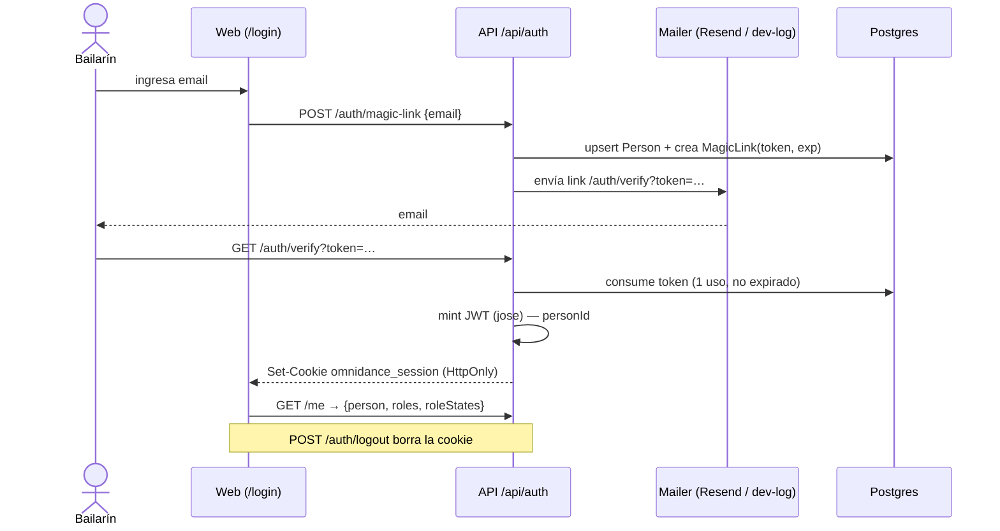

## Sesión de baile — invitar → confirmar → puntuar

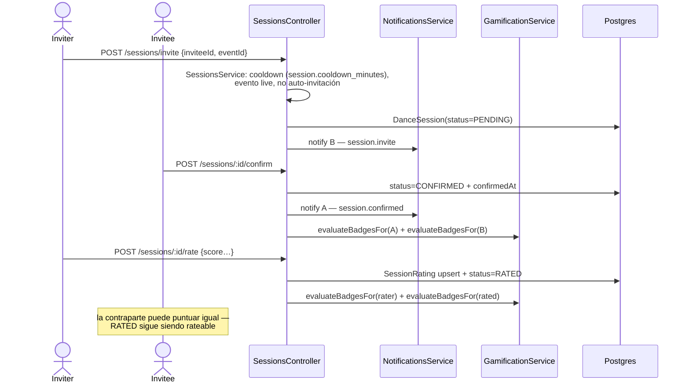

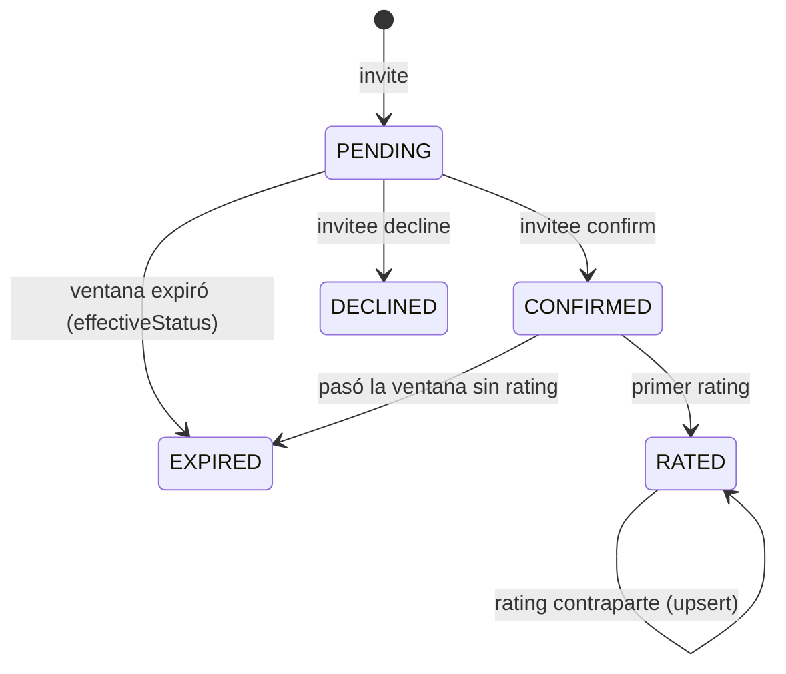

`RATED` y `CONFIRMED` cuentan como actividad para streaks/badges/misiones/leaderboard.

## Checkout → webhook → ticket

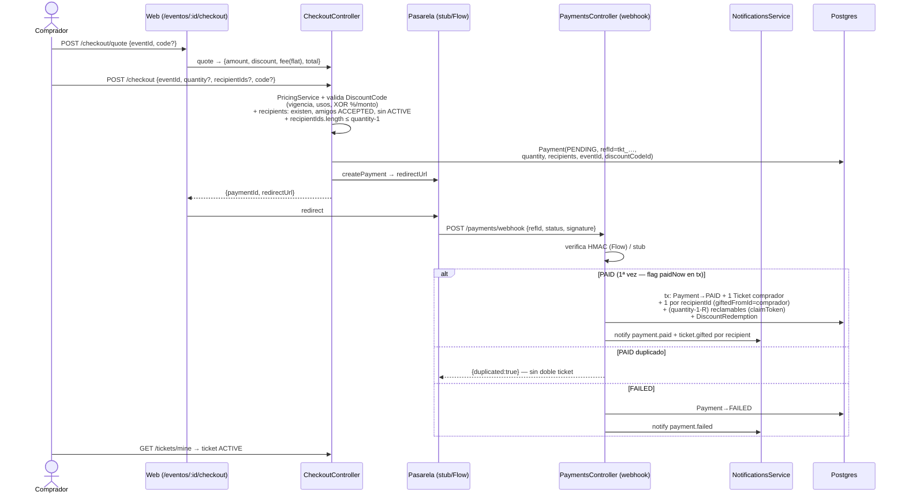

El webhook resuelve la orden por `refId` (order-ref `tkt_<event>_<code>` embebido en `stub://pay/<refId>`); `eventId`/`discountCodeId` son desnormalización para reporting.

## Check-in en puerta (staff)

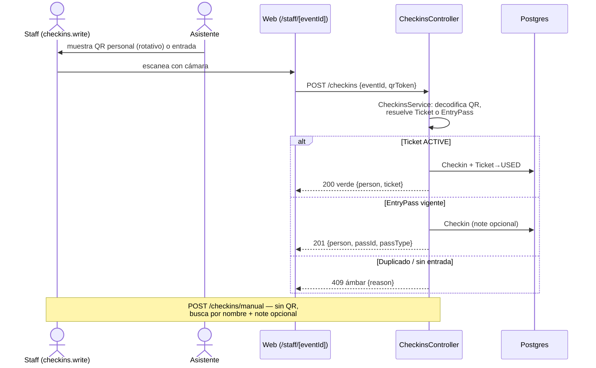

## Waitlist → promoción

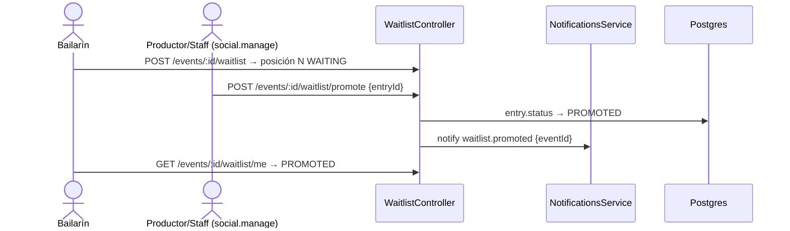

## Ciclo de asignación de rol

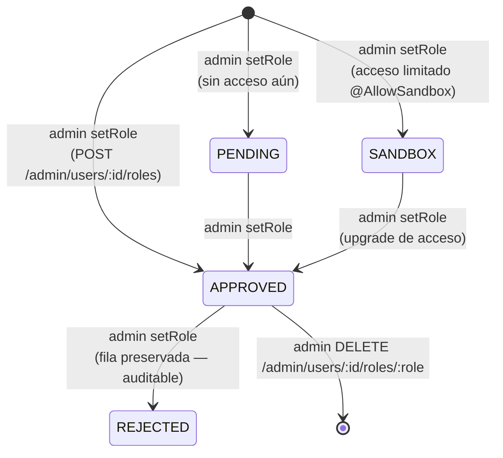

- No hay auto-solicitud de roles: el admin gestiona todo el ciclo desde `/admin/usuarios` (`role-requests` y `roles/request` fueron eliminados).
- `PENDING` y `REJECTED`: sin acceso, no aparece en `req.person.roles` (sí en `roleStates` de `/me`).
- `SANDBOX`: acceso solo a endpoints marcados `@AllowSandbox` (hoy `POST /academies`).

## Ticket — estados y transferencia

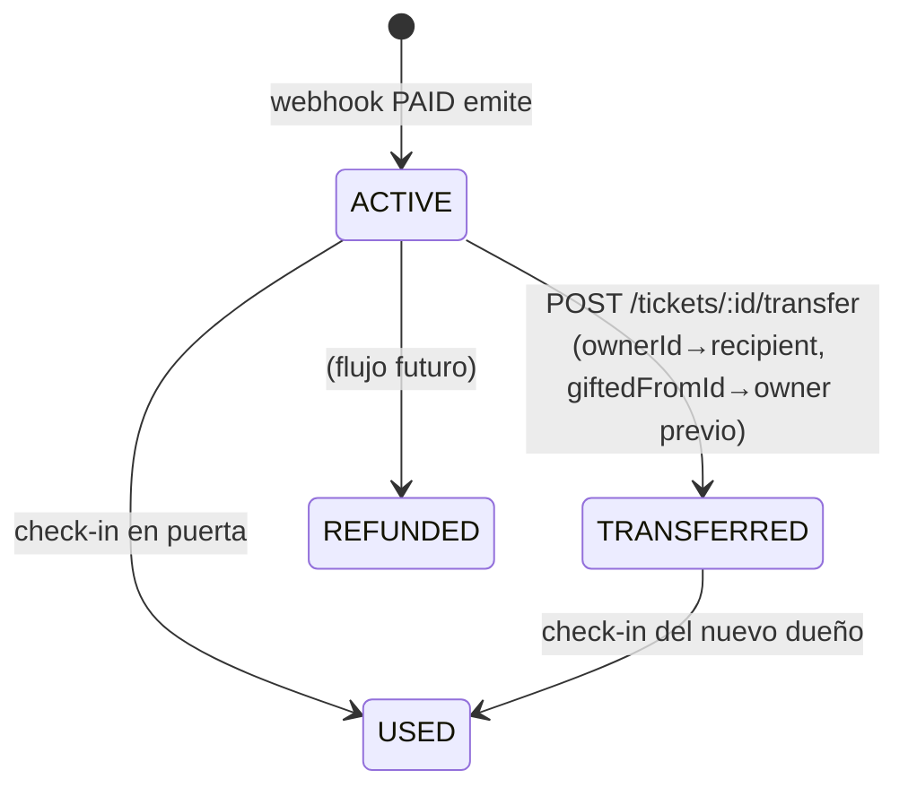

- `buyerId` **no cambia** al transferir (trazabilidad del comprador original).
- El ticket transferido queda `ACTIVE` — el nuevo dueño lo ve en `/entradas` y su QR.

## Entradas reclamables (claim links)

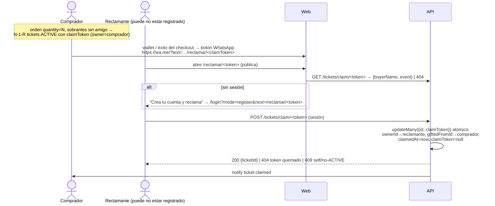

- El `claimToken` (16 bytes hex) vive en `Ticket` — sin tabla extra. Un ticket reclamable es `ACTIVE` con `claimToken != null` y `claimedAt = null`.
- `paymentId` en cada ticket vincula exacto con la orden que lo emitió (trazabilidad compra→ticket).
- Transferir manual (`POST /tickets/:id/transfer`) **quema** el claimToken — el link viejo muere.

## Discovery social

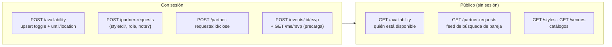

- `GET /me/rsvp` devuelve el RSVP propio por evento — la UI precarga el estado sin endpoint por-evento.
- `availability` es upsert por personId; `until`/`location` ausentes limpian a null.
- `partner-requests` valida `styleId` contra el catálogo (de `/api/styles`); el join person/style es manual (schema sin relaciones).

## Admin — parámetros y auditoría

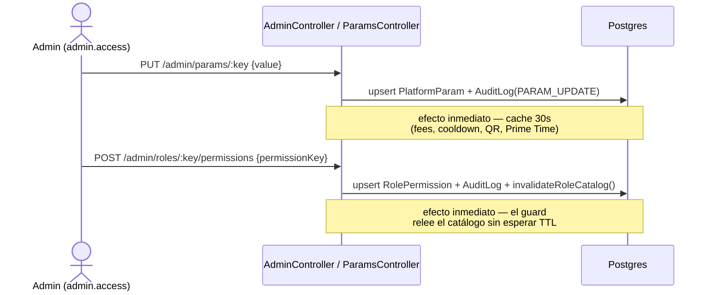

## Venta en puerta (door-sale, cuenta ligera)

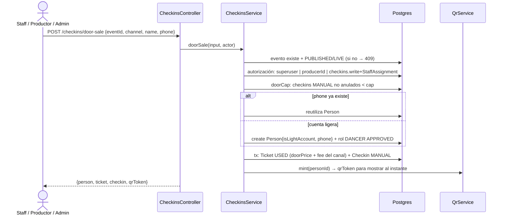

## Prime Time — contador → reveal

```mermaid
sequenceDiagram
    actor DJ as Pantalla/DJ (público)
    participant API as EventGamificationController
    participant Dom as GamificationService
    participant DB as Postgres

    DJ->>API: GET /events/:id/prime-time
    Dom->>DB: confirmedSessionsForEvent (retroDeclared:false!)
    Note over Dom: ventana happyHour, umbral<br/>override | 20% aforo (param)
    API-->>DJ: {current, threshold, unlocked, window}

    DJ->>API: GET /events/:id/prime-time/reveal
    alt no desbloqueado
        API-->>DJ: {unlocked:false}
    else desbloqueado, antes del fin de ventana
        API-->>DJ: {unlocked:true, revealed:false}
    else reveal
        Dom->>DB: ratedSessionsForEvent (sin retro) + styleRoles
        Note over Dom: bayes (Σv+C·m)/(n+C), ≥3 eval<br/>leader/follower + pareja mutua ≥4
        Dom->>DB: PersonBadge prime_time_crown +7d (idempotente)
        API-->>DJ: {bestLeader, bestFollower, coupleOfTheNight}
```

## Puntos de temporada (PointLedger)

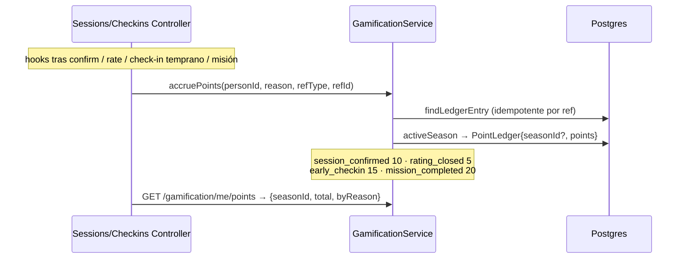

## Bloques y amistades (safety/social)

```mermaid
sequenceDiagram
    actor U as Usuario
    participant API as Blocks/Friends/Sessions Controllers
    participant DB as Postgres

    U->>API: POST /blocks {personId} — silencioso, sin notificación
    U->>API: POST /sessions/invite|declare
    API->>DB: UserBlock (invitee → inviter) existe?
    Note over API: sí → 403 genérico "no se puede enviar la invitación"<br/>NUNCA revelar que existe el bloqueo

    U->>API: POST /friends {personId} → PENDING + notifica al destinatario
    Note over DB: aId=solicitante, bId=destinatario<br/>solo bId acepta; ambos pueden borrar
    U->>API: GET /friends → {friends, pendingReceived, pendingSent}
```

## Check-in — salida y anulación

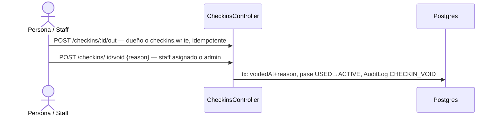

## Productor — ciclo de vida del evento

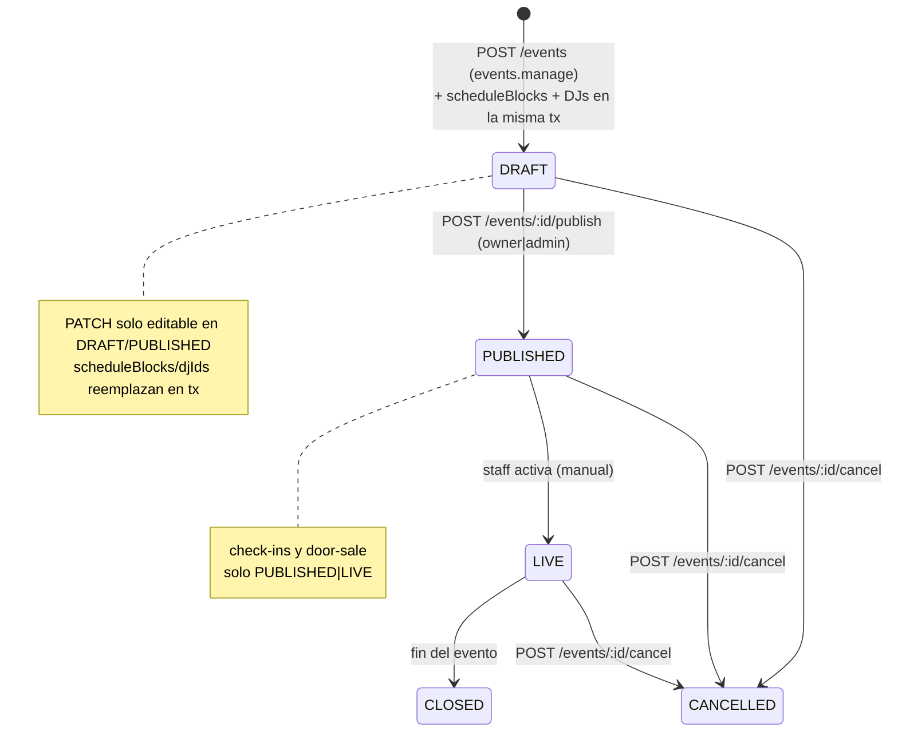

## Pase de serie — compra → webhook → check-in

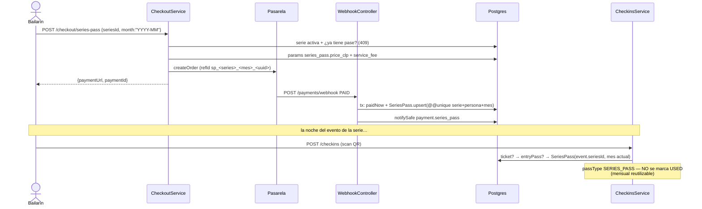

## Payouts — liquidación del productor

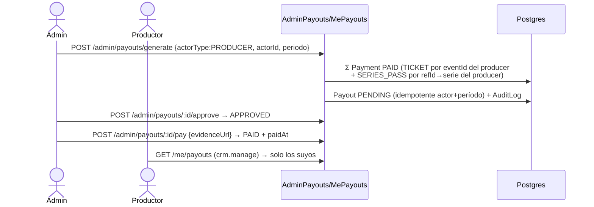

## CRM — score → segmento → campaña/trigger

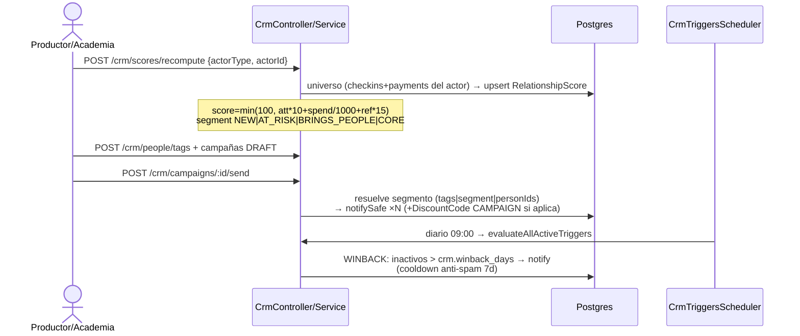

## Notificaciones — fan-out tiempo real

```mermaid
sequenceDiagram
    participant Dom as Cualquier dominio
    participant NS as NotificationsService
    participant DB as Postgres
    participant WS as NotificationsGateway
    participant WP as WebPushSender
    actor U as App del usuario

    Dom->>NS: notify(personId, input) / notifySafe
    NS->>DB: create Notification (IN_APP)
    NS->>WS: emitToPerson → room person:{id}
    WS-->>U: event "notification" (socket.io,<br/>auth por cookie de sesión en handshake)
    NS->>WP: sendToPerson (PushTokens de la persona)
    WP-->>U: Web Push (VAPID; no-op seguro sin keys,<br/>404/410 limpia el token muerto)
    Note over NS: ambos best-effort — un fallo de WS/push<br/>nunca rompe el notify ni el dominio origen
```

## Liquidaciones — payouts por actor

```mermaid
sequenceDiagram
    actor Ad as Admin
    participant API as AdminPayoutsController
    participant DB as Postgres
    actor Ow as Productor/Dueño academia/venue

    Ad->>API: POST /admin/payouts/generate {actorType, actorId, período}
    API->>DB: idempotente: payout existente → devuelve sin recalcular
    Note over API,DB: PRODUCER: tickets de sus eventos + series-pass de sus series<br/>ACADEMY/VENUE: tickets PAID de eventos con<br/>academyId|venueId=actorId AND producerId=null<br/>(entidad produjo directo — con productor, éste devenga)<br/>gross = Σ amount · net = gross − Σ fee
    API->>DB: create Payout PENDING + AuditLog PAYOUT_GENERATE
    Ad->>API: POST /admin/payouts/:id/approve → APPROVED
    Ad->>API: POST /admin/payouts/:id/pay {evidenceUrl} → PAID + paidAt
    Ow->>API: GET /me/payouts (crm.manage)
    API->>DB: PRODUCER por personId + ACADEMY por Academy.ownerId<br/>+ VENUE por Venue.ownerId → unión
```

## Comisión parametrizable — cadena de resolución

```mermaid
flowchart TD
    A[checkout ticket / webhook PAID] --> B{event.serviceFeeClp != null?}
    B -->|sí| C[fee = event.serviceFeeClp<br/>override admin por evento]
    B -->|no| D[fee = param service_fee.presale_clp]
    D --> E[→ env SERVICE_FEE_CLP → default shared]
    C --> F[quote = listPrice + fee − descuento]
    E --> F
    F --> G[Payment.amount / Payment.fee]
    H[POST/PATCH /events con serviceFeeClp] --> I{admin.access?}
    I -->|sí| J[persiste override · null limpia]
    I -->|no| K[403 — solo admin fija comisión]
```
