# Flujos - omni-dance

Secuencias y máquinas de estado de los flujos principales. Mantener sincronizado con los controllers en `apps/api/src/*/infrastructure/`.

## Autenticación - magic link

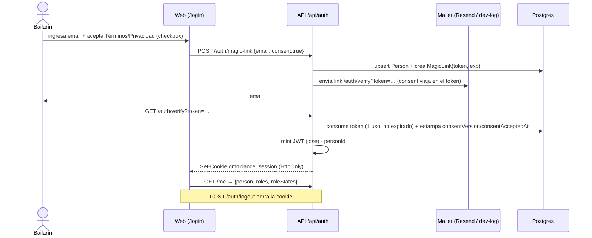
```mermaid
sequenceDiagram
    actor U as Bailarín
    participant W as Web (/login)
    participant A as API /api/auth
    participant M as Mailer (Resend / dev-log)
    participant DB as Postgres

    U->>W: ingresa email + acepta Términos/Privacidad (checkbox)
    W->>A: POST /auth/magic-link {email, consent:true}
    A->>DB: upsert Person + crea MagicLink(token, exp)
    A->>M: envía link /auth/verify?token=… (consent viaja en el token)
    M-->>U: email
    U->>A: GET /auth/verify?token=…
    A->>DB: consume token (1 uso, no expirado) + estampa consentVersion/consentAcceptedAt
    A->>A: mint JWT (jose) - personId
    A-->>W: Set-Cookie omnidance_session (HttpOnly)
    W->>A: GET /me → {person, roles, roleStates}
    Note over W,A: POST /auth/logout borra la cookie
```

## Sesión de baile - escanear QR → puntuar

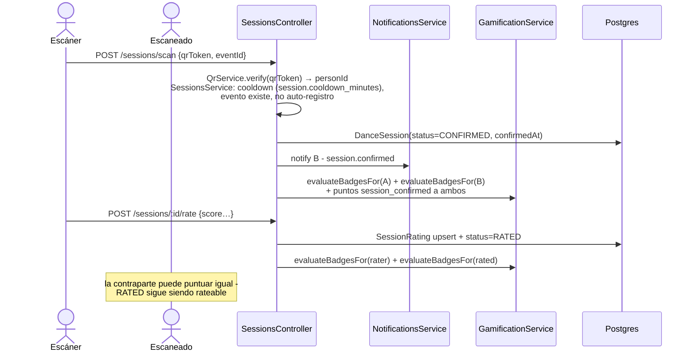
```mermaid
sequenceDiagram
    actor A as Escáner
    actor B as Escaneado
    participant API as SessionsController
    participant N as NotificationsService
    participant G as GamificationService
    participant DB as Postgres

    A->>API: POST /sessions/scan {qrToken, eventId}
    API->>API: QrService.verify(qrToken) → personId<br/>SessionsService: cooldown (session.cooldown_minutes),<br/>evento existe, no auto-registro
    API->>DB: DanceSession(status=CONFIRMED, confirmedAt)
    API->>N: notify B - session.confirmed
    API->>G: evaluateBadgesFor(A) + evaluateBadgesFor(B)<br/>+ puntos session_confirmed a ambos
    A->>API: POST /sessions/:id/rate {score…}
    API->>DB: SessionRating upsert + status=RATED
    API->>G: evaluateBadgesFor(rater) + evaluateBadgesFor(rated)
    Note over B: la contraparte puede puntuar igual -<br/>RATED sigue siendo rateable
```

El ciclo de invitación (`/sessions/invite` + `/:id/confirm` + `/:id/decline`)
se eliminó: el escaneo QR en pista acredita presencia mutua, así que la
sesión nace CONFIRMED. Las `DanceSession` históricas INVITED/DECLINED se
conservan como dato. `POST /sessions/declare` (retro-declarar) también se
eliminó: **todo alta de DanceSession pasa por escaneo QR** - no hay vía
manual.

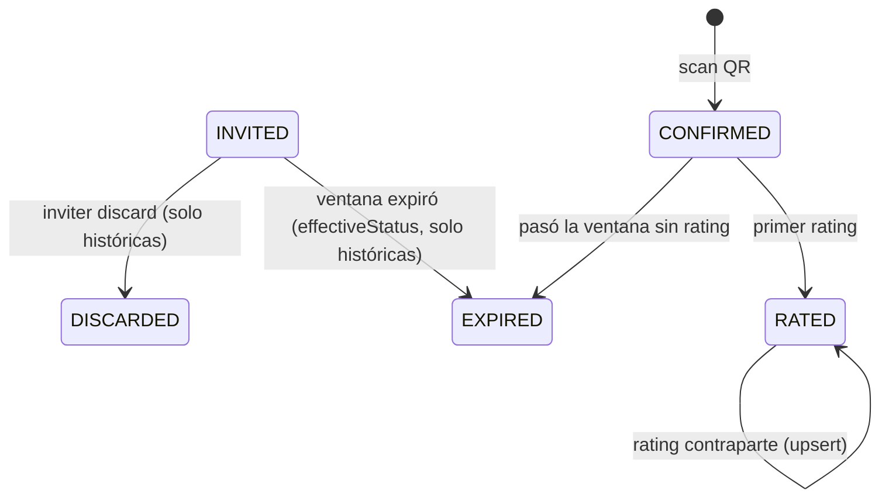
```mermaid
stateDiagram-v2
    [*] --> CONFIRMED: scan QR
    INVITED --> DISCARDED: inviter discard (solo históricas)
    INVITED --> EXPIRED: ventana expiró (effectiveStatus, solo históricas)
    CONFIRMED --> RATED: primer rating
    RATED --> RATED: rating contraparte (upsert)
    CONFIRMED --> EXPIRED: pasó la ventana sin rating
```

`RATED` y `CONFIRMED` cuentan como actividad para streaks/badges/misiones/leaderboard.

## Checkout → webhook → ticket

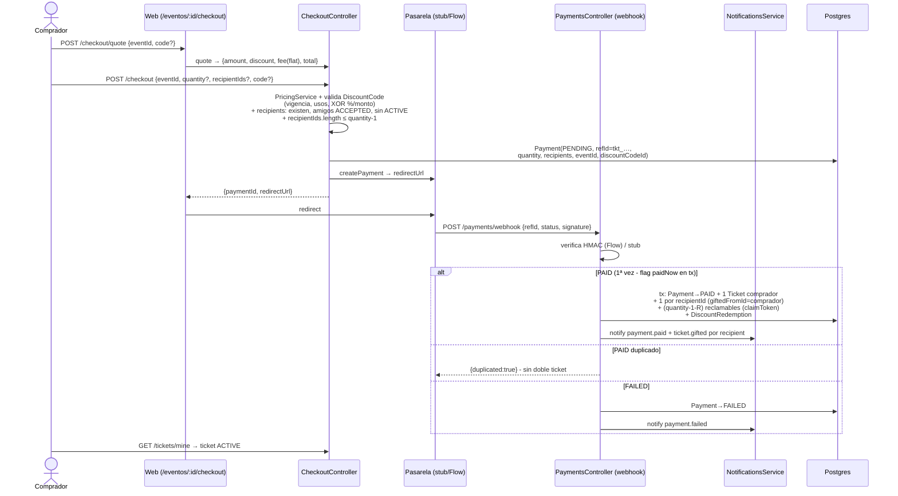
```mermaid
sequenceDiagram
    actor U as Comprador
    participant W as Web (/eventos/:id/checkout)
    participant API as CheckoutController
    participant GW as Pasarela (stub/Flow)
    participant WH as PaymentsController (webhook)
    participant N as NotificationsService
    participant DB as Postgres

    U->>W: POST /checkout/quote {eventId, code?}
    W->>API: quote → {amount, discount, fee(flat), total}
    U->>API: POST /checkout {eventId, quantity?, recipientIds?, code?}
    API->>API: PricingService + valida DiscountCode<br/>(vigencia, usos, XOR %/monto)<br/>+ recipients: existen, amigos ACCEPTED, sin ACTIVE<br/>+ recipientIds.length ≤ quantity-1
    API->>DB: Payment(PENDING, refId=tkt_…,<br/>quantity, recipients, eventId, discountCodeId)
    API->>GW: createPayment → redirectUrl
    API-->>W: {paymentId, redirectUrl}
    W->>GW: redirect
    GW->>WH: POST /payments/webhook {refId, status, signature}
    WH->>WH: verifica HMAC (Flow) / stub
    alt PAID (1ª vez - flag paidNow en tx)
        WH->>DB: tx: Payment→PAID + 1 Ticket comprador<br/>+ 1 por recipientId (giftedFromId=comprador)<br/>+ (quantity-1-R) reclamables (claimToken)<br/>+ DiscountRedemption
        WH->>N: notify payment.paid + ticket.gifted por recipient
    else PAID duplicado
        WH-->>GW: {duplicated:true} - sin doble ticket
    else FAILED
        WH->>DB: Payment→FAILED
        WH->>N: notify payment.failed
    end
    U->>API: GET /tickets/mine → ticket ACTIVE
```

El webhook resuelve la orden por `refId` (order-ref `tkt_<event>_<code>` embebido en `stub://pay/<refId>`); `eventId`/`discountCodeId` son desnormalización para reporting.

> **Flow real**: la notificación llega como `{token}` → la API consulta `payment/getStatus` firmado para confirmar (nunca confía en el body). Si la orden sigue PENDING al volver del pago, el polling de `GET /payments/:id` la consulta directamente vía `payment/getStatusByCommerceId` - mismo `settle` idempotente del webhook. Esto permite probar el sandbox de Flow desde localhost sin exponer la API (Flow no puede hacer POST a localhost).

## Corte de preventa + orden gratuita (event-presale-cutoff)

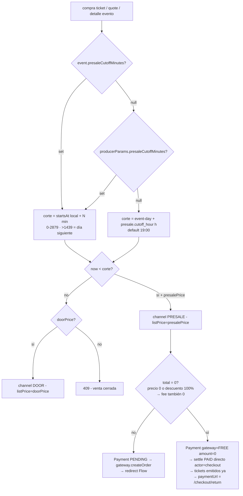
```mermaid
flowchart TD
    A[compra ticket / quote / detalle evento] --> B{event.presaleCutoffMinutes?}
    B -->|set| C[corte = startsAt local + N min<br/>0-2879 · >1439 = día siguiente]
    B -->|null| D{producerParams.presaleCutoffMinutes?}
    D -->|set| C
    D -->|null| E[corte = event-day + presale.cutoff_hour h<br/>default 19:00]
    C --> F{now < corte?}
    E --> F
    F -->|sí + presalePrice| G[channel PRESALE - listPrice=presalePrice]
    F -->|no| H{doorPrice?}
    H -->|sí| I[channel DOOR - listPrice=doorPrice]
    H -->|no| J[409 - venta cerrada]
    G --> K{total = 0?<br/>precio 0 o descuento 100%<br/>→ fee también 0}
    K -->|no| L[Payment PENDING → gateway.createOrder<br/>→ redirect Flow]
    K -->|sí| M[Payment gateway=FREE amount=0<br/>→ settle PAID directo actor=checkout<br/>→ tickets emitidos ya<br/>→ paymentUrl = /checkout/return]
```

La cadena de resolución del corte es la misma de las fees (evento → productor → global). El helper puro `resolvePresaleCutoffMinutes` en `src/common/presale-cutoff.ts` la centraliza - la usan `purchaseTicket`, `discountQuote` y el detalle de evento (`presaleEndsAt` que muestra la app). Post-medianoche: `presaleCutoffMinutes` es minutos desde las 00:00 del día local del evento, así 1500 = 01:00 del día siguiente.

**Orden $0**: `PricingService.quote` ya exime el fee cuando el neto es 0 (preventa gratis o cupón 100% cobran $0 de fee). Si el total final es 0 no hay nada que cobrar: el checkout marca el Payment `gateway="FREE"`, salta `gateway.createOrder` y lo liquida por el mismo `settle(...,"PAID")` del webhook - tickets, claim links y notificaciones idénticos a un pago normal. El front ve un `paymentUrl` normal de retorno, nada distinto.

Edición: `presaleCutoffMinutes` del evento lo define el productor en el form (`type="time"`, vacío = heredar; valores post-medianoche solo por API) o el admin; el default por productor se edita en `/productor/parametros` (PUT `/producer/table-params`) y en `/admin/parametros` (`/admin/producers/:id/fee-params`).

## Check-in en puerta (staff)

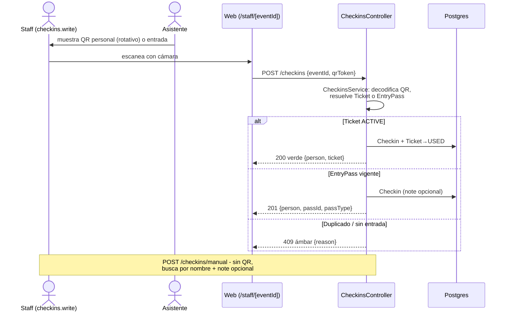
```mermaid
sequenceDiagram
    actor S as Staff (checkins.write)
    actor D as Asistente
    participant W as Web (/staff/[eventId])
    participant API as CheckinsController
    participant DB as Postgres

    D->>S: muestra QR personal (rotativo) o entrada
    S->>W: escanea con cámara
    W->>API: POST /checkins {eventId, qrToken}
    API->>API: CheckinsService: decodifica QR,<br/>resuelve Ticket o EntryPass
    alt Ticket ACTIVE
        API->>DB: Checkin + Ticket→USED
        API-->>W: 200 verde {person, ticket}
    else EntryPass vigente
        API->>DB: Checkin (note opcional)
        API-->>W: 201 {person, passId, passType}
    else Duplicado / sin entrada
        API-->>W: 409 ámbar {reason}
    end
    Note over S,API: POST /checkins/manual - sin QR,<br/>busca por nombre + note opcional
```

## Waitlist → promoción

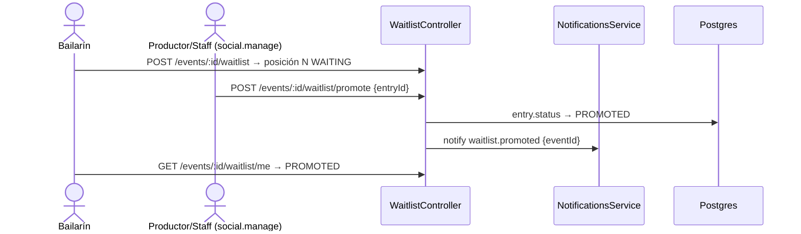
```mermaid
sequenceDiagram
    actor U as Bailarín
    actor P as Productor/Staff (social.manage)
    participant API as WaitlistController
    participant N as NotificationsService
    participant DB as Postgres

    U->>API: POST /events/:id/waitlist → posición N WAITING
    P->>API: POST /events/:id/waitlist/promote {entryId}
    API->>DB: entry.status → PROMOTED
    API->>N: notify waitlist.promoted {eventId}
    U->>API: GET /events/:id/waitlist/me → PROMOTED
```

## Ciclo de asignación de rol

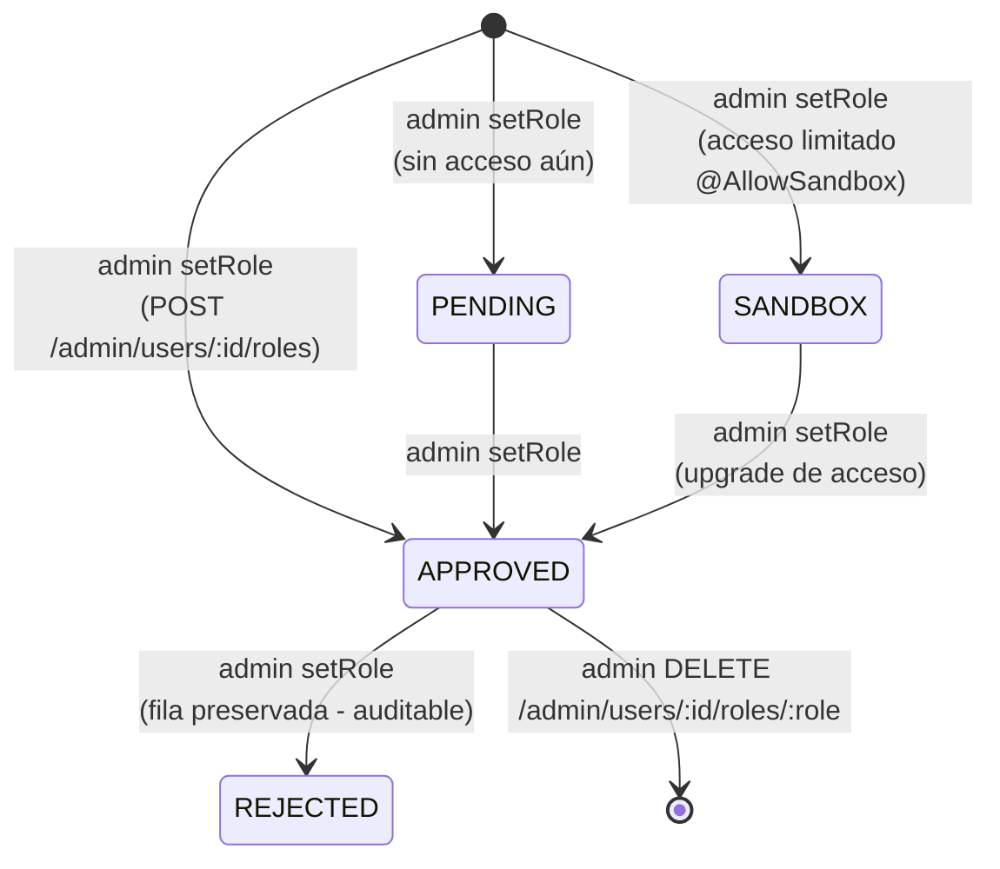
```mermaid
stateDiagram-v2
    [*] --> APPROVED: admin setRole<br/>(POST /admin/users/:id/roles)
    [*] --> PENDING: admin setRole<br/>(sin acceso aún)
    [*] --> SANDBOX: admin setRole<br/>(acceso limitado @AllowSandbox)
    PENDING --> APPROVED: admin setRole
    SANDBOX --> APPROVED: admin setRole<br/>(upgrade de acceso)
    APPROVED --> REJECTED: admin setRole<br/>(fila preservada - auditable)
    APPROVED --> [*]: admin DELETE /admin/users/:id/roles/:role
```

- No hay auto-solicitud de roles: el admin gestiona todo el ciclo desde `/admin/usuarios` (`role-requests` y `roles/request` fueron eliminados).
- `PENDING` y `REJECTED`: sin acceso, no aparece en `req.person.roles` (sí en `roleStates` de `/me`).
- `SANDBOX`: acceso solo a endpoints marcados `@AllowSandbox` (hoy `POST /academies`).

## Ticket - estados y transferencia

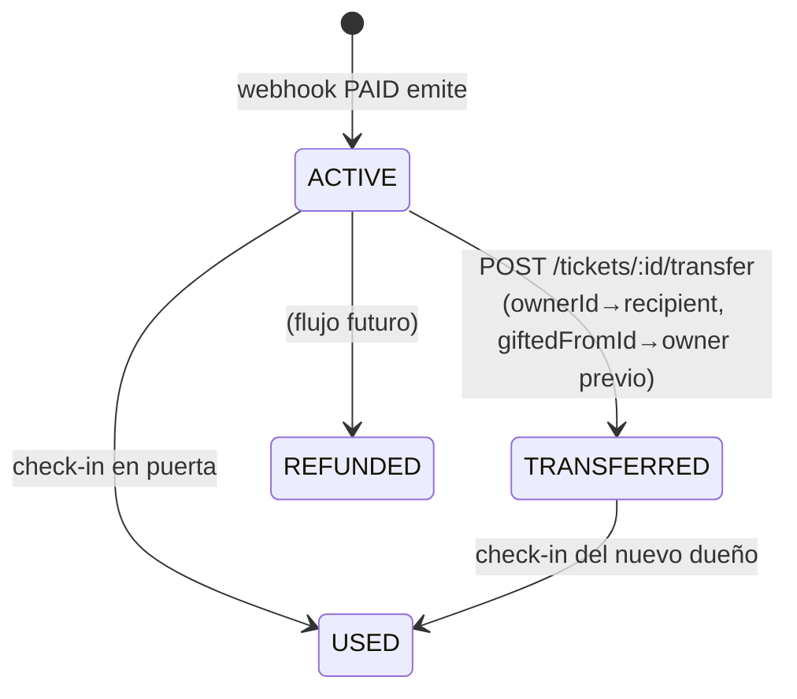
```mermaid
stateDiagram-v2
    [*] --> ACTIVE: webhook PAID emite
    ACTIVE --> USED: check-in en puerta
    ACTIVE --> TRANSFERRED: POST /tickets/:id/transfer<br/>(ownerId→recipient, giftedFromId→owner previo)
    TRANSFERRED --> USED: check-in del nuevo dueño
    ACTIVE --> REFUNDED: (flujo futuro)
```

- `buyerId` **no cambia** al transferir (trazabilidad del comprador original).
- El ticket transferido queda `ACTIVE` - el nuevo dueño lo ve en `/entradas` y su QR.

## Entradas reclamables (claim links)

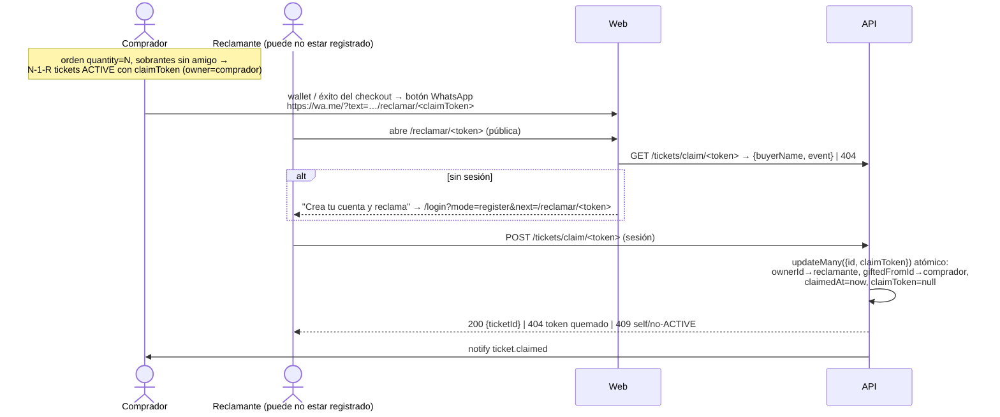
```mermaid
sequenceDiagram
    actor B as Comprador
    actor R as Reclamante (puede no estar registrado)
    participant W as Web
    participant API as API

    Note over B: orden quantity=N, sobrantes sin amigo →<br/>N-1-R tickets ACTIVE con claimToken (owner=comprador)
    B->>W: wallet / éxito del checkout → botón WhatsApp<br/>https://wa.me/?text=…/reclamar/<claimToken>
    R->>W: abre /reclamar/<token> (pública)
    W->>API: GET /tickets/claim/<token> → {buyerName, event} | 404
    alt sin sesión
        W-->>R: "Crea tu cuenta y reclama" → /login?mode=register&next=/reclamar/<token>
    end
    R->>API: POST /tickets/claim/<token> (sesión)
    API->>API: updateMany({id, claimToken}) atómico:<br/>ownerId→reclamante, giftedFromId→comprador,<br/>claimedAt=now, claimToken=null
    API-->>R: 200 {ticketId} | 404 token quemado | 409 self/no-ACTIVE
    API->>B: notify ticket.claimed
```

- El `claimToken` (16 bytes hex) vive en `Ticket` - sin tabla extra. Un ticket reclamable es `ACTIVE` con `claimToken != null` y `claimedAt = null`.
- `paymentId` en cada ticket vincula exacto con la orden que lo emitió (trazabilidad compra→ticket).
- Transferir manual (`POST /tickets/:id/transfer`) **quema** el claimToken - el link viejo muere.

## Discovery social

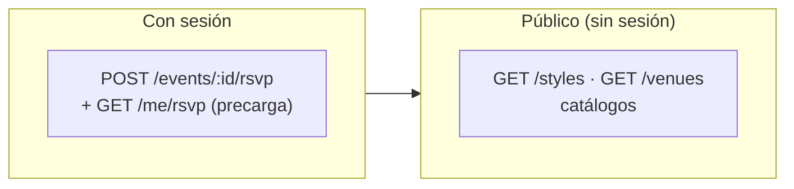
```mermaid
flowchart LR
    subgraph Public["Público (sin sesión)"]
        ST["GET /styles · GET /venues<br/>catálogos"]
    end
    subgraph Auth["Con sesión"]
        RSVP["POST /events/:id/rsvp<br/>+ GET /me/rsvp (precarga)"]
    end
    Auth --> Public
```

- `GET /me/rsvp` devuelve el RSVP propio por evento - la UI precarga el estado sin endpoint por-evento.
- `/availability` y `/partner-requests` se eliminaron junto a sus modelos (los bailes se registran solo por escaneo QR).

## Admin - parámetros y auditoría

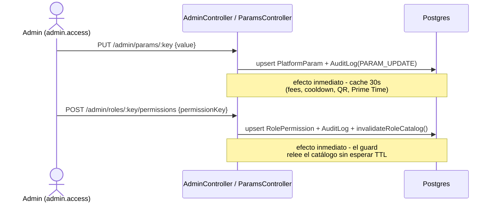
```mermaid
sequenceDiagram
    actor Ad as Admin (admin.access)
    participant API as AdminController / ParamsController
    participant DB as Postgres

    Ad->>API: PUT /admin/params/:key {value}
    API->>DB: upsert PlatformParam + AuditLog(PARAM_UPDATE)
    Note over API,DB: efecto inmediato - cache 30s<br/>(fees, cooldown, QR, Prime Time)
    Ad->>API: POST /admin/roles/:key/permissions {permissionKey}
    API->>DB: upsert RolePermission + AuditLog + invalidateRoleCatalog()
    Note over API,DB: efecto inmediato - el guard<br/>relee el catálogo sin esperar TTL
```

## Venta en puerta (door-sale, cuenta ligera)

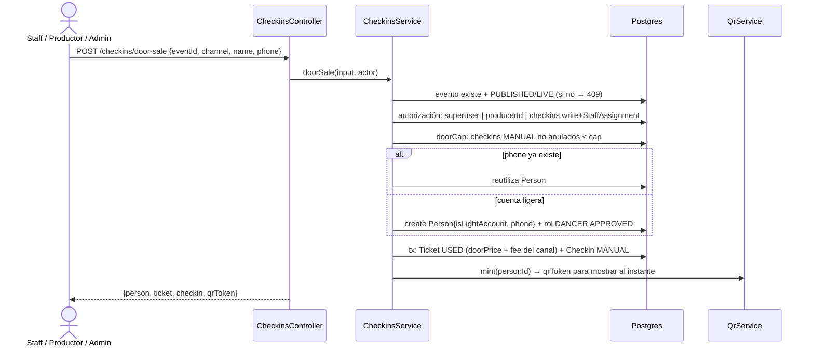
```mermaid
sequenceDiagram
    actor S as Staff / Productor / Admin
    participant API as CheckinsController
    participant Dom as CheckinsService
    participant DB as Postgres
    participant QR as QrService

    S->>API: POST /checkins/door-sale {eventId, channel, name, phone}
    API->>Dom: doorSale(input, actor)
    Dom->>DB: evento existe + PUBLISHED/LIVE (si no → 409)
    Dom->>DB: autorización: superuser | producerId | checkins.write+StaffAssignment
    Dom->>DB: doorCap: checkins MANUAL no anulados < cap
    alt phone ya existe
        Dom->>DB: reutiliza Person
    else cuenta ligera
        Dom->>DB: create Person{isLightAccount, phone} + rol DANCER APPROVED
    end
    Dom->>DB: tx: Ticket USED (doorPrice + fee del canal) + Checkin MANUAL
    Dom->>QR: mint(personId) → qrToken para mostrar al instante
    API-->>S: {person, ticket, checkin, qrToken}
```

## Prime Time - contador → reveal

```mermaid
sequenceDiagram
    actor DJ as Pantalla/DJ (público)
    participant API as EventGamificationController
    participant Dom as GamificationService
    participant DB as Postgres

    DJ->>API: GET /events/:id/prime-time
    Dom->>DB: confirmedSessionsForEvent (retroDeclared:false!)
    Note over Dom: ventana happyHour, umbral<br/>override | 20% aforo (param)
    API-->>DJ: {current, threshold, unlocked, window}

    DJ->>API: GET /events/:id/prime-time/reveal
    alt no desbloqueado
        API-->>DJ: {unlocked:false}
    else desbloqueado, antes del fin de ventana
        API-->>DJ: {unlocked:true, revealed:false}
    else reveal
        Dom->>DB: ratedSessionsForEvent (sin retro) + styleRoles
        Note over Dom: bayes (Σv+C·m)/(n+C), ≥3 eval<br/>leader/follower + pareja mutua ≥4
        Dom->>DB: PersonBadge prime_time_crown +7d (idempotente)
        API-->>DJ: {bestLeader, bestFollower, coupleOfTheNight}
```

## Puntos de temporada (PointLedger)

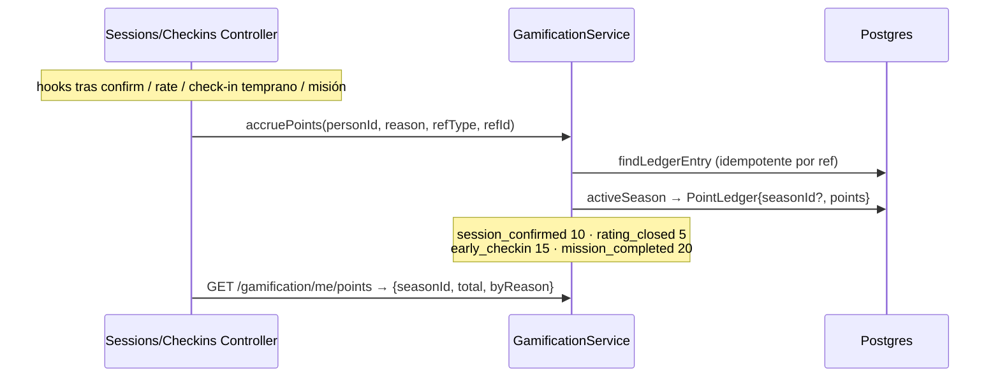
```mermaid
sequenceDiagram
    participant C as Sessions/Checkins Controller
    participant Dom as GamificationService
    participant DB as Postgres

    Note over C: hooks tras confirm / rate / check-in temprano / misión
    C->>Dom: accruePoints(personId, reason, refType, refId)
    Dom->>DB: findLedgerEntry (idempotente por ref)
    Dom->>DB: activeSeason → PointLedger{seasonId?, points}
    Note over Dom: session_confirmed 10 · rating_closed 5<br/>early_checkin 15 · mission_completed 20
    C->>Dom: GET /gamification/me/points → {seasonId, total, byReason}
```

## Amistades (social)

El sistema de bloqueo de personas se eliminó completo (endpoints,
`UserBlock` y su enforcement en invitaciones - los bailes se registran
solo por escaneo QR en pista).

```mermaid
sequenceDiagram
    actor U as Usuario
    participant API as FriendsController
    participant DB as Postgres

    U->>API: POST /friends {personId} → PENDING + notifica al destinatario
    Note over DB: aId=solicitante, bId=destinatario<br/>solo bId acepta; ambos pueden borrar
    U->>API: GET /friends → {friends, pendingReceived, pendingSent}
```

## Check-in - salida y anulación

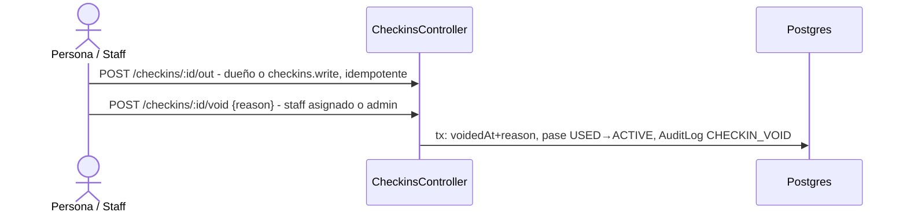
```mermaid
sequenceDiagram
    actor P as Persona / Staff
    participant API as CheckinsController
    participant DB as Postgres

    P->>API: POST /checkins/:id/out - dueño o checkins.write, idempotente
    P->>API: POST /checkins/:id/void {reason} - staff asignado o admin
    API->>DB: tx: voidedAt+reason, pase USED→ACTIVE, AuditLog CHECKIN_VOID
```

## Productor - ciclo de vida del evento

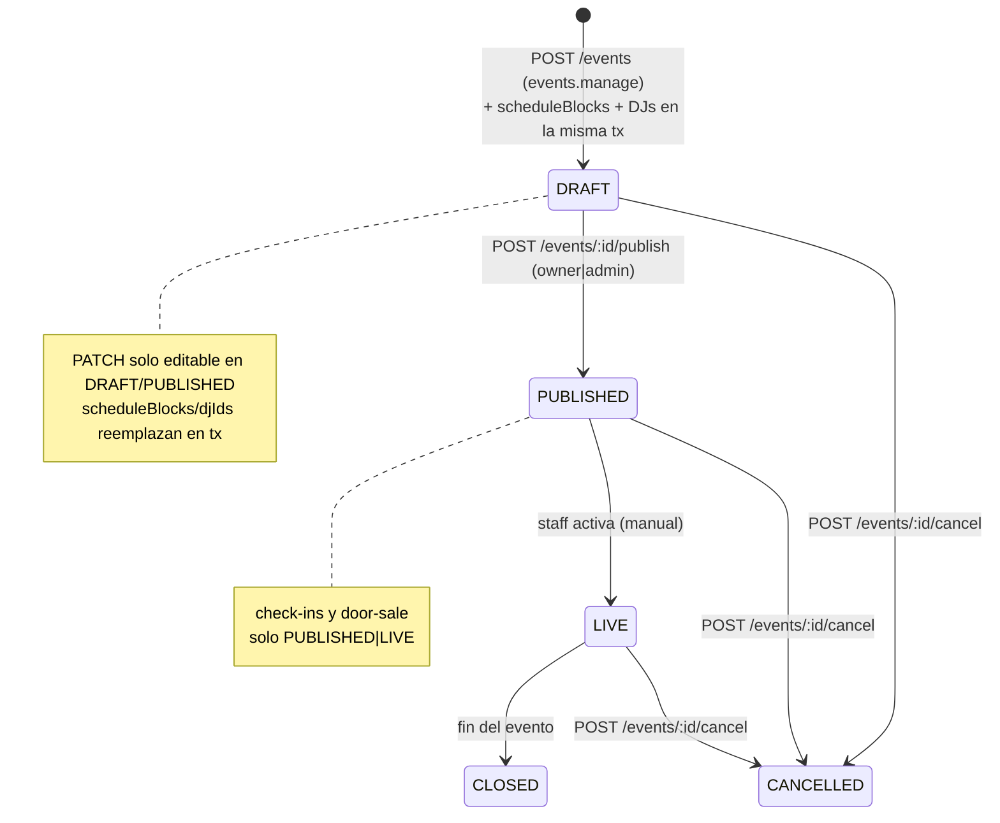
```mermaid
stateDiagram-v2
    [*] --> DRAFT: POST /events (events.manage)<br/>+ scheduleBlocks + DJs en la misma tx
    DRAFT --> PUBLISHED: POST /events/:id/publish (owner|admin)
    PUBLISHED --> LIVE: staff activa (manual)
    DRAFT --> CANCELLED: POST /events/:id/cancel
    PUBLISHED --> CANCELLED: POST /events/:id/cancel
    LIVE --> CANCELLED: POST /events/:id/cancel
    LIVE --> CLOSED: fin del evento
    note right of DRAFT: PATCH solo editable en DRAFT/PUBLISHED<br/>scheduleBlocks/djIds reemplazan en tx
    note right of PUBLISHED: check-ins y door-sale<br/>solo PUBLISHED|LIVE
```

## Pase de serie - compra → webhook → check-in

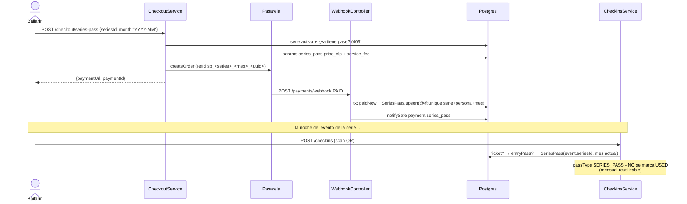
```mermaid
sequenceDiagram
    actor U as Bailarín
    participant API as CheckoutService
    participant GW as Pasarela
    participant WH as WebhookController
    participant DB as Postgres
    participant CK as CheckinsService

    U->>API: POST /checkout/series-pass {seriesId, month:"YYYY-MM"}
    API->>DB: serie activa + ¿ya tiene pase? (409)
    API->>DB: params series_pass.price_clp + service_fee
    API->>GW: createOrder (refId sp_<series>_<mes>_<uuid>)
    API-->>U: {paymentUrl, paymentId}
    GW->>WH: POST /payments/webhook PAID
    WH->>DB: tx: paidNow + SeriesPass.upsert(@@unique serie+persona+mes)
    WH->>DB: notifySafe payment.series_pass
    Note over U,CK: la noche del evento de la serie…
    U->>CK: POST /checkins (scan QR)
    CK->>DB: ticket? → entryPass? → SeriesPass(event.seriesId, mes actual)
    Note over CK: passType SERIES_PASS - NO se marca USED<br/>(mensual reutilizable)
```

## Plan de academia - compra → webhook → enrollment

```mermaid
sequenceDiagram
    actor U as Bailarín
    participant API as CheckoutService
    participant GW as Pasarela
    participant WH as WebhookController
    participant DB as Postgres

    Note over U: entrada 1: ficha /academias/:id (card de plan → Comprar)<br/>entrada 2: /clases/:id sin inscripción → "Ver planes"
    U->>API: POST /checkout/membership {planId}
    API->>DB: plan activo + academia activa (TRIAL solo con price>0;<br/>la gratis es asignación staff → 400)
    API->>DB: params service_fee.membership_clp + precio del plan
    API->>GW: createOrder (refId mem_<planId>_<uuid>)
    API-->>U: {paymentUrl, paymentId}
    GW->>WH: POST /payments/webhook PAID
    WH->>DB: tx: paidNow + Enrollment findFirst→update/create<br/>(ACTIVE, planId, endsAt por tipo calendario)<br/>TRIAL → create fila TRIAL nueva, nunca toca la vigente
    WH->>DB: notifySafe payment.membership
    Note over WH,DB: vigencia: MONTHLY fin de mes · QUARTERLY 3er mes ·<br/>SEMIANNUAL 6º · SINGLE día+1 · PERIOD +periodDays<br/>TRIAL +periodDays si configurado, si no sin fecha<br/>renovación: base = endsAt vigente + 1d
```

`Enrollment.endsAt` de compras online usa mediodía Chile (~15:00 UTC) del último día válido - misma convención que el alta staff por input date. Enrollment no tiene @@unique(academyId,personId) - el histórico se permite; el settle hace findFirst + update/create en la tx (idempotente por paidNow), salvo plan TRIAL que siempre crea una fila `status: TRIAL` nueva sin tocar la inscripción vigente (la re-compra acumula filas). Los pagos MEMBERSHIP devengan a la academia en payouts (refId → plan → academyId, fee % global).

## Pago directo a la academia - comprobante → validación → vigencia (MANUAL)

```mermaid
sequenceDiagram
    actor U as Alumno
    actor Ow as Dueño academia
    participant API as AcademyClaimsController
    participant DB as Postgres
    participant FS as Storage disco (UPLOADS_DIR)

    Note over U: ficha /academias/:id - "Pagar a la academia"<br/>muestra AcademyPaymentMethod activos<br/>(TRANSFER datos bancarios / PAYMENT_LINK url / CASH)
    U->>API: GET /academies/:id/payment-methods (sesión)
    U->>API: POST /academies/:id/claims multipart<br/>{receipt imagen|pdf ≤5MB, amount, methodId?, planId?, note?}
    API->>FS: put claims/<academyId>/<uuid>.<ext>
    API->>DB: PaymentClaim PENDING + notifySafe al owner
    Ow->>API: GET /academies/:id/claims (consola /academia/cobros - cap payments)
    Ow->>API: GET /academies/:id/claims/:claimId/receipt (stream autenticado)
    Ow->>API: POST .../claims/:id/approve
    API->>DB: tx: claim PENDING? (409 si no) + reviewer administra academia<br/>+ Payment{orderType MEMBERSHIP, gateway MANUAL, PAID}<br/>+ si planId: Enrollment findFirst→update/create<br/>endsAt por membershipBase/membershipEndsAt (misma regla webhook Flow)
    API->>DB: notifySafe payment.claim.approved al alumno
    Note over Ow: rechazo: POST .../claims/:id/reject {reason}<br/>claim REJECTED + reviewNote + notifySafe al alumno
```

- El comprobante es una **declaración** del alumno: la plataforma no verifica el pago externo; el dueño valida contra su cartola. La UI lo explicita.
- `Payment{gateway:"MANUAL"}` queda en el libro para analítica pero **nunca devenga payout** - el dinero no pasó por la plataforma.
- Approve sin `planId` solo registra el pago (no toca enrollment); con `planId` extiende desde `endsAt` vigente o crea el enrollment si el alumno no tiene uno para esa academia.
- Los archivos viven bajo `UPLOADS_DIR` (dev `./uploads`, prod `/app/uploads` con bind mount al disco dedicado de la VM) - **nunca** se sirven por estático público; el endpoint exige ser dueño del claim o admin de la academia.
- Academia sin métodos propios configurados: la card no aparece y el alumno sigue el checkout Flow normal (passthrough con comisión plataforma).
- **Quién valida queda auditado** (academy-staff-roles): cualquier colaborador con capacidad `payments` puede aprobar/rechazar (no solo el owner) y cada claim resuelto expone `reviewedBy{id,name}` + `reviewedAt` - la consola muestra "Aprobado/Rechazado por X · fecha" en el historial.

## Recordatorios de renovación - barrido diario → email + notificación (academy-renewal-reminders)

```mermaid
sequenceDiagram
    participant CRON as AcademiesScheduler (09:00)
    participant SVC as AcademyRemindersService
    participant DB as Postgres
    participant MAIL as Resend (MAILER)
    actor U as Alumno

    CRON->>SVC: runDaily() (skip en NODE_ENV=test)
    SVC->>DB: Enrollment ACTIVE|ONLINE<br/>endsAt ∈ [now, now+first_notice_days)<br/>+ endsAt ∈ [now-grace_days, now)<br/>person.findMany por lote (Enrollment no<br/>tiene relación a Person - personId suelto)
    loop por ciclo sin avisar
        SVC->>MAIL: mail "por vencer" o "en gracia"<br/>(academia + plan + fecha + CTA /academias/:id)
        SVC->>DB: notifySafe academy.plan_expiring / plan_grace
        SVC->>DB: reminderExpiringFor|ExpiredFor = endsAt del ciclo
    end
    U->>DB: paga (Flow online o claim MANUAL aprobado)<br/>→ endsAt nuevo re-arma los avisos del siguiente ciclo
```

- **Dos avisos por ciclo**: "por vencer" cuando `endsAt` cae dentro de `academy.renewal.first_notice_days` (default 5d); "en gracia" cuando `endsAt` ya venció pero dentro de `academy.renewal.grace_days` (default 5d) - el mail dice hasta qué fecha puede pagar y que después no podrá agendar clases del mes.
- **Idempotente por ciclo**: `Enrollment.reminderExpiringFor`/`reminderExpiredFor` guardan el `endsAt` que gatilló cada aviso; un `endsAt` nuevo (renovación, extensión manual) re-arma los dos avisos. Un mail que falla loguea y no marca - reintenta el día siguiente.
- **Elegibilidad**: solo `ACTIVE`/`ONLINE` con `endsAt` (TRIAL no recibe avisos de renovación pagada; `endsAt` null = packs/legado nunca expira). Alumno sin email igual recibe la notificación in-app y queda marcado.
- **Vigencia efectiva en reservas**: `resolveQuota` exige `now <= endsAt + grace_days` para clases dentro de ese rango - una inscripción vencida habilita clases solo hasta `endsAt + grace` (mismo número del mail); pasada la gracia no resuelve cuota.
- **Notificación al owner por pago**: `settleMembership` envía `payment.membership.received` a `academy.ownerId` dentro del bloque `paidNow` (compra online y renovaciones automáticas Flow - nunca en webhooks/reconcile duplicados). Los claims MANUAL ya notifican al owner al crearse (`payment_claim_new`); la aprobación la hace el mismo owner.

## Equipo de academia - invitación → acceso por capacidad (academy-staff-roles)

```mermaid
sequenceDiagram
    actor Ow as Dueño academia
    actor C as Colaborador
    participant API as AcademyStaffController
    participant DB as Postgres
    participant MAIL as Resend (MAILER)

    Ow->>API: POST /academies/:id/staff (cap team)<br/>{email, name?, caps: {payments, students, ...}}
    alt correo ya registrado
        API->>DB: AcademyStaff upsert (flags)
    else correo nuevo
        API->>DB: Person stub {email,name} + AcademyStaff
        API->>MAIL: invitación con magic link 7d<br/>("X te agregó a su equipo")
    end
    C->>API: GET /api/auth/verify?token (crea sesión + cuenta)
    C->>API: GET /academies/mine (incluye academias como staff)
    C->>API: operación de consola (p.ej. GET /:id/claims)
    API->>DB: requireCapability(academyId, me, "payments")<br/>staff sin flag → 403 {error:"academy.capability"}
```

- **Capacidades granulares** (`AcademyStaff.can*`): `students` (alumnos/enrollments), `payments` (comprobantes + medios de pago + libro), `plans` (membresías), `schedule` (series/horarios/videos), `profile` (ficha pública), `team` (gestionar colaboradores y comisiones), `billing` (suscripción SaaS). Owner y `admin.access` pasan todo implícito; el instructor sigue operativo (asistencia/clases) sin capacidades administrativas.
- **Mantenedor `/academia/equipo`**: alta por email con toggles por capacidad, PATCH por flag individual, quitar (DELETE) con efecto inmediato. Restricciones: el owner no es fila staff (400 `owner_not_staff`) y nadie se edita a sí mismo (400 `cannot_modify_self`).
- **La consola se adapta al acceso**: `GET /academies/:id/access` devuelve `{isOwner,isAdmin,isInstructor,isStaff,caps}`; el hub `/academia` muestra solo los módulos que el acceso cubre.
- **Auditoría de comprobantes**: cada aprobación/rechazo de `PaymentClaim` guarda `reviewedById`+`reviewedAt`; el historial de `/academia/cobros` muestra quién validó cada pago - clave cuando varios colaboradores procesan comprobantes.
- **Mora aplica igual**: toda mutación staff pasa por `requireCapabilityWrite` → academia bloqueada por suscripción impaga = read-only también para el equipo (la lectura sigue abierta).

## Migración desde otra plataforma - import CSV → alumnos y horario (academy-bulk-import)

```mermaid
sequenceDiagram
    actor Ow as Dueño/Staff
    participant API as AcademyImportController
    participant DB as Postgres
    participant MAIL as Resend (MAILER)

    Note over Ow: /academia/importar - descarga plantilla<br/>GET /academies/:id/import/template/students|schedule
    Ow->>API: POST /academies/:id/import/students (cap students)<br/>multipart CSV: email,nombre,telefono?,plan,pagado_hasta?
    loop por fila (reporte por fila - un error no aborta)
        alt Person existe
            API->>DB: enrollment findFirst → update (endsAt=max, planId)<br/>o create ACTIVE si no tenía
        else correo nuevo
            API->>DB: Person stub + Enrollment ACTIVE con endsAt importado
            API->>MAIL: invitación magic link 7d (studentInviteEmailHtml)
        end
    end
    API-->>Ow: results[] {row,email,status: imported|updated|invited|error,detail}

    Ow->>API: POST /academies/:id/import/schedule (cap schedule)<br/>CSV: serie,estilo?,nivel?,dia_semana,hora_inicio,hora_fin,...
    API->>API: agrupa por serie+mes → upsert ClassSeries<br/>slot dedup por weekday+start+end → Class del mes materializadas
    API-->>Ow: results[] {row,serie,status: ok|warn|error,detail}
```

- **Alumnos**: el plan se resuelve por nombre contra los planes activos de la academia (match case/acento-insensible); `pagado_hasta` (YYYY-MM-DD) → `endsAt` al mediodía UTC (el día completo cubierto en Chile). Re-importar es seguro: `endsAt = max(existente, importado)`.
- **Horario**: `dia_semana` acepta 0-6 o nombre en español; `estilo`/`nivel` se validan contra catálogo (no se auto-crean); `instructor_email` debe ser instructor de la academia - si no existe, el slot queda sin instructor con `warn`. Los Class del mes se materializan igual que `POST /series`.
- **Límites**: CSV ≤2MB y ≤500 filas; columnas requeridas ausentes → 400. Parser propio en `src/common/csv.ts` (comillas, `""`, \r\n, BOM) - sin dependencia nueva.

## Clase suelta / taller - compra → asiento pagado (WORKSHOP)

```mermaid
sequenceDiagram
    actor U as Alumno
    participant API as CheckoutService
    participant GW as Pasarela
    participant WH as WebhookController
    participant DB as Postgres

    Note over U: ficha /clases/:id sin inscripción/cuota y con<br/>ClassSeries.dropInPrice → CTA "comprar solo esta clase"
    U->>API: GET /checkout/class-quote?classId=:id
    U->>API: POST /checkout/class {classId}
    API->>DB: clase futura + dropInPrice>0 + cupo libre (409 llena)
    API->>GW: createOrder (refId wks_<classId>_<uuid>, orderType WORKSHOP)
    API-->>U: {paymentUrl, paymentId}
    GW->>WH: POST /payments/webhook PAID
    WH->>DB: tx: paidNow + ClassBooking BOOKED con paymentId<br/>(upsert sobre WAITLIST/CANCELLED propio; 409 si llena)
    WH->>DB: notifySafe payment.class_dropin
```

- El asiento pagado **no consume cuota** del plan (`resolveQuota` excluye bookings con `paymentId`); convive con una membresía sin interacción.
- Devenga a la academia en payouts (`wks_` → class → slot.academyId, fee % global).

## Clase particular - compra como producto → asignación por el owner (PRIVATE)

```mermaid
sequenceDiagram
    actor U as Alumno
    participant API as CheckoutService
    participant GW as Pasarela
    participant WH as WebhookController
    participant PL as PrivateLessonsController
    participant DB as Postgres

    Note over U: perfil /academias/:id - card "Clase particular" junto<br/>a los planes cuando Academy.privateLessonPrice > 0
    U->>API: GET /checkout/private-class-quote?academyId=:id
    U->>API: POST /checkout/private-class {academyId}
    API->>DB: academia activa + privateLessonPrice>0 (404/400)
    API->>GW: createOrder (refId pvt_<academyId>_<uuid>, orderType PRIVATE)
    API-->>U: {paymentUrl, paymentId}
    GW->>WH: POST /payments/webhook PAID
    WH->>DB: tx: paidNow + PrivateLesson REQUESTED<br/>sin instructor ni fecha, paymentId, price=unitListPrice
    WH->>DB: notifySafe payment.paid al alumno<br/>+ academy.private_lesson.purchased al owner

    participant O as Owner
    O->>PL: PATCH /private-lessons/:id<br/>{action:"assign", instructorId, scheduledAt}
    PL->>DB: REQUESTED→CONFIRMED + instructorId + scheduledAt<br/>+ snapshot AcademyInstructor.commissionPct
    PL->>DB: notifySafe academy.private_lesson.assigned<br/>a alumno e instructor
```

- La fecha **la define el owner** post-compra ("por agendar" en reservadas de `/clases` mientras `scheduledAt=null`); el instructor puede reagendar después. La distinción con WORKSHOP es el aforo: taller = varios asistentes con fecha fija; particular = 1 alumno, se coordina tras el pago.
- `POST /academies/:id/private-lessons` queda **staff-only** para clases manuales (cortesía/convenio, opcional `personId`); el alumno compra, no solicita.
- `Academy.privateLessonPrice = null` → la academia no vende particulares (card oculta, checkout 400).
- Devenga a la academia en payouts - el refId `pvt_` codifica la academia directamente (incluso si no tiene eventos/planes/clases). Una particular **cancelada** no devenga: el pago se excluye de `by-academy`/payouts y el owner recibe `academy.private_lesson.cancelled_paid` (la devolución al alumno es manual vía Flow).
- Liquidación de la comisión academia→instructor: `PATCH /private-lessons/:id {action:"pay-commission"}` (owner/ADMIN) marca `PrivateLesson.commissionPaidAt` sobre CONFIRMED/DONE con comisión >0 - la plataforma no transfiere, el owner paga por fuera (criterio Payout). Notifica `private_lesson.commission_paid` al instructor; `mine?as=instructor` expone `commissionPaidAt`.
- **Vista alumno unificada**: `GET /classes/mine` devuelve las particulares activas mergeadas como reservas más (`series:null`, `date:null` si no están agendadas - grupo "Por agendar"; cancelar vive en la ficha `/clases/[id]`, que resuelve la particular vía `GET /private-lessons/:id`). Las terminales (DONE/CANCELLED) llegan en `/classes/mine?scope=past`. `/private-lessons/mine` queda solo para instructores (`?as=instructor`).

## Reserva de clase - cuota del plan + cancelación con corte

```mermaid
sequenceDiagram
    actor U as Alumno
    participant API as ClassesController
    participant DB as Postgres

    U->>API: POST /classes/:id/book
    API->>DB: tx: inscripción vigente + cuota (resolveQuota)<br/>semanal → pack → ilimitado
    alt sin inscripción vigente
        API-->>U: 403
    else cupo libre y cuota agotada
        API-->>U: 409 "agotaste tus clases de esta semana"
    else cupo libre
        API->>DB: BOOKED + enrollmentId (qué plan consumió)
    else clase llena
        API->>DB: WAITLIST - no consume cuota
    end

    U->>API: DELETE /classes/:id/book
    API->>DB: params classes.cancel_refund_minutes (def 60)
    Note over API: inicio = Class.date (00:00 UTC) + slot.startTime
    alt a tiempo (now ≤ inicio − corte) o era WAITLIST
        API->>DB: CANCELLED, refunded=true, cancelledAt - el crédito vuelve
    else dentro del corte
        API->>DB: CANCELLED, refunded=false, cancelledAt -<br/>el crédito se consume igual
    end
    API->>DB: waitlist: promueve al primero CON cuota vigente<br/>(los sin cuota quedan en espera) + notifySafe
```

- **Consume crédito**: `BOOKED` + `CANCELLED` con `refunded=false`. `WAITLIST` y `CANCELLED` con `refunded=true` no consumen.
- **Semana de la cuota**: ISO lun–dom sobre `Class.date` (UTC); el pack cuenta desde `Enrollment.startedAt` sin caducidad.
- **Cancelación por la academia** (desactivar serie / borrar slot) siempre marca `refunded=true` - nadie pierde crédito por una decisión ajena.
- "La clase ya pasó" se evalúa contra el inicio real (`date + startTime`), no contra la medianoche del día - reservar el mismo día sí funciona.
- UI: `GET /classes/:id` expone `myCredits {kind, used, limit}` + `cancelRefundMinutes`; el sheet de cancelar declara la consecuencia antes de confirmar y `/classes/mine` adjunta `credits` por card.

## Suscripción de academia - alta y renovación (Flow)

```mermaid
sequenceDiagram
    actor U as Bailarín
    participant API as SubscriptionsService
    participant GW as Flow
    participant DB as Postgres

    U->>API: POST /checkout/membership-subscription<br/>{planId, acceptRecurring:true}
    API->>DB: tx + pg_advisory_xact_lock(person):<br/>barre PENDING_CARD pendientes,<br/>crea/reusa MembershipSubscription PENDING_CARD
    API->>GW: ensurePlan omni_<planId> (lazy)<br/>+ customer/create (lazy → Person.flowCustomerId)
    alt sin tarjeta registrada
        API->>GW: customer/register → registerUrl
        API-->>U: {kind:needs_card, registerUrl, subscriptionId}
        U->>GW: disclaimer de tarjeta (Flow)
        GW->>API: POST /payments/flow/customer-return {token}
        API->>GW: customer/getRegisterStatus → tarjeta OK
        API->>DB: claim atómico PENDING_CARD→ACTIVATING
    else tarjeta ya registrada
        API->>DB: claim atómico PENDING_CARD→ACTIVATING
        API-->>U: (tras create) {kind:subscribed}
    end
    API->>GW: subscription/create (cobra 1er período,<br/>fija next_invoice_date)
    API->>DB: ACTIVE + flowSubscriptionId + nextInvoiceAt<br/>+ reconcile del 1er invoice → Payment mem_* → settle
    Note over API,GW: customer-return responde 303 →<br/>/academias/:id?sub=ok - nunca error HTTP
```

```mermaid
sequenceDiagram
    participant CRON as SubscriptionsScheduler (cron 09:00)
    participant WH as subscription-webhook (urlCallback del plan)
    participant GET as GET /subscriptions/:id
    participant GW as Flow
    participant API as reconcileSubscription
    participant DB as Postgres

    Note over CRON,GET: tres gatillos del mismo barrido -<br/>webhook fast-path, polling del dueño, cron (red de seguridad)
    CRON->>GW: subscription/get (por sub ACTIVE/CANCEL_PENDING)
    WH->>API: {token} → reconcileAll fire-and-forget (200 siempre)
    GET->>GW: subscription/get (refresh activo del detalle)
    GW-->>API: invoices[] + status + next_invoice_date + morose
    alt invoice pagada nueva (dedup lastInvoiceId + refId único)
        API->>DB: Payment PENDING mem_<planId>_<invoiceId><br/>+ ORDER_CREATED
        API->>DB: settleMembership → PAID + RENEWAL_SETTLED<br/>+ Enrollment.endsAt extendido
        API->>DB: notify payment.membership
    end
    API->>DB: sync: nextInvoiceAt · cancel_at_period_end→CANCEL_PENDING<br/>· status=4→CANCELED
    opt nextInvoiceAt < 24h (dedup reminderSentFor)
        API->>DB: notify membership.renewal_reminder
    end
    opt morose=1 con invoice impaga (dedup por invoiceId)
        API->>DB: RENEWAL_FAILED + notify membership.renewal_failed
        Note over API,DB: sin grace period - el enrollment expira<br/>solo en endsAt; la sub sigue viva (Flow reintenta)
    end
```

```mermaid
stateDiagram-v2
    [*] --> PENDING_CARD: subscribe (sin tarjeta aún)
    PENDING_CARD --> CANCELED: sweep de otro subscribe / TTL expirado / cancel
    PENDING_CARD --> ACTIVATING: claim atómico<br/>(subscribe con tarjeta · customer-return)
    ACTIVATING --> PENDING_CARD: subscription/create falló<br/>(reversión del claim)
    ACTIVATING --> ACTIVE: subscription/create OK (Flow cobra 1er período)
    ACTIVATING --> CANCELED: status remoto 4
    ACTIVE --> CANCEL_PENDING: cancel del usuario<br/>(Flow at_period_end=1 - conserva el período pagado)
    ACTIVE --> CANCELED: reconcile ve status=4
    CANCEL_PENDING --> CANCELED: reconcile ve status=4<br/>(fin del período ya pagado)
```

- **Cancelación `at_period_end`**: `POST /subscriptions/:id/cancel` llama `subscription/cancel` con `at_period_end=1` → `CANCEL_PENDING`; el usuario conserva el acceso hasta el fin del período ya pagado y el próximo reconcile cierra a `CANCELED` cuando Flow reporta `status=4`.
- **Reminder el día previo**: cuando `nextInvoiceAt` queda a <24 h y la sub sigue `ACTIVE`, el reconcile notifica `membership.renewal_reminder` una sola vez por fecha (`reminderSentFor` la dedup - si Flow mueve la fecha, se vuelve a avisar).

## Ledger de pago - evidencia hash-chain (BIAN)

```mermaid
sequenceDiagram
    participant GW as Flow
    participant WH as PaymentsController
    participant SET as PaymentSettlementService
    participant DB as Postgres (PaymentEvent)
    participant Ad as Admin (admin.access)

    GW->>WH: POST /payments/webhook {token}
    WH->>GW: payment/getStatus firmado → {refId, status, paymentData}
    Note over WH,GW: cada request/response Flow → GatewayTransaction OUTBOUND<br/>(append-only, correlationId, firma "s" → huella sha256)
    WH->>SET: recordWebhookReceived
    SET->>DB: WEBHOOK_RECEIVED (siempre - duplicado también es evidencia)
    SET->>SET: settle: re-check status en tx (idempotente)
    alt transición real → PAID
        SET->>DB: Payment→PAID + gatewayFeeClp/gatewayReportedAmount/<br/>gatewayMedia/gatewayPaidAt/gatewayRaw
        SET->>DB: STATUS_CONFIRMED → [AMOUNT_MISMATCH] →<br/>SETTLED (compra) | RENEWAL_SETTLED (suscripción)
        Note over DB: payloadHash = sha256(prevHash +<br/>canonicalJson({paymentId,seq,type,actor,payload}))<br/>- editar una fila rompe la cadena
    else transición real → FAILED
        SET->>DB: STATUS_CONFIRMED + FAILED
    else ya PAID (re-notificación)
        SET-->>WH: {duplicated:true} - sin eventos ni efectos
    end
    Ad->>WH: GET /admin/payments/:id/verify-chain
    WH-->>Ad: {ok, events, firstBadSeq?} - verifyPaymentChain re-calcula
    Note over WH: GET /payments/:id/events (dueño/admin):<br/>ledger completo ordenado por seq
```

- `canonicalJson` = `JSON.stringify(sortKeys(JSON.parse(JSON.stringify(v))))` - round-trip a JSON puro antes de ordenar keys para que emit y verify converjan al mismo string que `jsonb` persiste (Date→ISO, Decimal→número; keys por codepoint).
- El writer de `GatewayTransaction` es best-effort: un fallo de escritura nunca rompe el pago - la auditoría es observador, no camino crítico.

## Payouts - liquidación del productor

```mermaid
sequenceDiagram
    actor Ad as Admin
    actor Pr as Productor
    participant API as AdminPayouts/MePayouts
    participant DB as Postgres

    Ad->>API: POST /admin/payouts/generate {actorType:PRODUCER, actorId, periodo}
    API->>DB: Σ Payment PAID (TICKET por eventId del producer<br/>+ SERIES_PASS por refId→serie del producer)
    API->>DB: Payout PENDING (idempotente actor+período) + AuditLog
    Ad->>API: POST /admin/payouts/:id/approve → APPROVED
    Ad->>API: POST /admin/payouts/:id/pay {evidenceUrl} → PAID + paidAt
    Pr->>API: GET /me/payouts (crm.manage) → solo los suyos
```

## CRM - score → segmento → campaña/trigger

```mermaid
sequenceDiagram
    actor P as Productor/Academia
    participant API as CrmController/Service
    participant DB as Postgres
    participant CRON as CrmTriggersScheduler

    P->>API: POST /crm/scores/recompute {actorType, actorId}
    API->>DB: universo (checkins+payments del actor) → upsert RelationshipScore
    Note over API: score=min(100, att*10+spend/1000+ref*15)<br/>segment NEW|AT_RISK|BRINGS_PEOPLE|CORE
    P->>API: POST /crm/people/tags + campañas DRAFT
    P->>API: POST /crm/campaigns/preview → {count} (sin enviar)
    P->>API: POST /crm/campaigns/:id/send
    API->>DB: resuelve segmento (tags|segment|personIds<br/>|allStudents|enrollmentStatus|planId|seriesId)<br/>→ notifySafe ×N (+DiscountCode CAMPAIGN si aplica)
    CRON->>API: diario 09:00 → evaluateAllActiveTriggers
    API->>DB: WINBACK: inactivos > crm.winback_days → notify<br/>(cooldown anti-spam 7d)
```

## Notificaciones - fan-out tiempo real

```mermaid
sequenceDiagram
    participant Dom as Cualquier dominio
    participant NS as NotificationsService
    participant DB as Postgres
    participant WS as NotificationsGateway
    participant WP as WebPushSender
    actor U as App del usuario

    Dom->>NS: notify(personId, input) / notifySafe
    NS->>DB: create Notification (IN_APP)
    NS->>WS: emitToPerson → room person:{id}
    WS-->>U: event "notification" (socket.io,<br/>auth por cookie de sesión en handshake)
    NS->>WP: sendToPerson (PushTokens de la persona)
    WP-->>U: Web Push (VAPID; no-op seguro sin keys,<br/>404/410 limpia el token muerto)
    Note over NS: ambos best-effort - un fallo de WS/push<br/>nunca rompe el notify ni el dominio origen
```

## Liquidaciones - payouts por actor

```mermaid
sequenceDiagram
    actor Ad as Admin
    participant API as AdminPayoutsController
    participant DB as Postgres
    actor Ow as Productor/Dueño academia/venue

    Ad->>API: POST /admin/payouts/generate {actorType, actorId, período}
    API->>DB: idempotente: payout existente → devuelve sin recalcular
    Note over API,DB: PRODUCER: tickets de sus eventos + series-pass de sus series<br/>ACADEMY/VENUE: tickets PAID de eventos con<br/>academyId|venueId=actorId AND producerId=null<br/>(entidad produjo directo - con productor, éste devenga)<br/>gross = Σ amount · net = gross − Σ fee
    API->>DB: create Payout PENDING + AuditLog PAYOUT_GENERATE
    Ad->>API: POST /admin/payouts/:id/approve → APPROVED
    Ad->>API: POST /admin/payouts/:id/pay {evidenceUrl} → PAID + paidAt
    Ow->>API: GET /me/payouts (crm.manage)
    API->>DB: PRODUCER por personId + ACADEMY por Academy.ownerId<br/>+ VENUE por Venue.ownerId → unión
```

## Comisión parametrizable - cadena de resolución

```mermaid
flowchart TD
    A[checkout ticket / webhook PAID] --> B{event.serviceFeeClp != null?}
    B -->|sí| C[fee = event.serviceFeeClp<br/>override admin por evento]
    B -->|no| D[fee = param service_fee.presale_clp]
    D --> E[→ env SERVICE_FEE_CLP → default shared]
    C --> F[quote = listPrice + fee − descuento]
    E --> F
    F --> G[Payment.amount / Payment.fee]
    H[POST/PATCH /events con serviceFeeClp] --> I{admin.access?}
    I -->|sí| J[persiste override · null limpia]
    I -->|no| K[403 - solo admin fija comisión]
```
